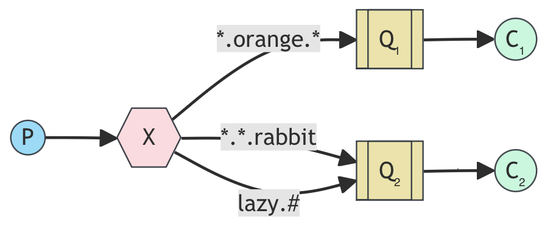
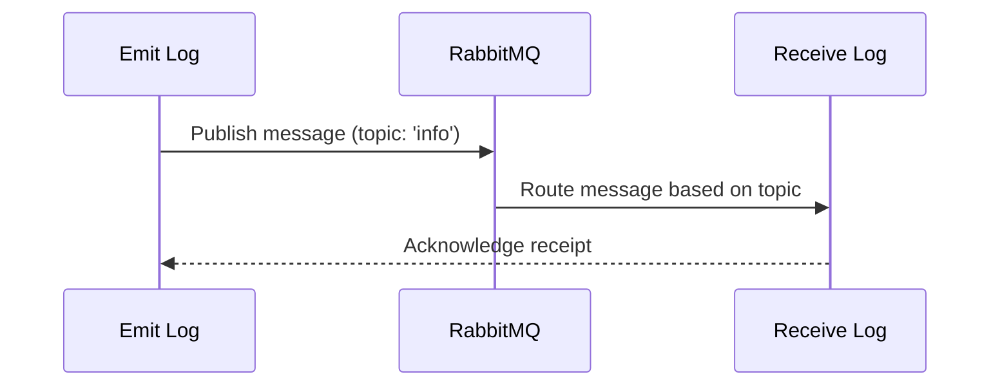

<!-- TOC -->

- [Simple Messaging System with RabbitMQ](#simple-messaging-system-with-rabbitmq)
	- [Description](#description)
	- [Technologies Used in this Project](#technologies-used-in-this-project)
	- [RabbitMQ](#rabbitmq)
	- [Docker](#docker)
	- [Project Structure](#project-structure)
	- [Docker Implementation](#docker-implementation)
	- [How to Run](#how-to-run)
	- [Project Diagram](#project-diagram)
	- [How to Send Messages and Receive Them](#how-to-send-messages-and-receive-them)
	- [Cleaning](#cleaning)
	- [Conclusion](#conclusion)
	- [Reference](#reference)
	- [Video Recording](#video-recording)

<!-- /TOC -->
<!-- /TOC -->
<!-- /TOC -->

# Simple Messaging System with RabbitMQ

## Author info

- Author: Youjin Park
- GitHub account: thepeanutbasket (https://github.com/thepeanutbasket)
- UMD email: ypark112@umd.edu
- Personal email: park.youjin331@gmail.com

## Description

This is a Python-based project that leverages RabbitMQ, a robust messaging system, diving deeper into RabbitMQ's capabilities by incorporating message acknowledgment mechanisms to ensure reliable message delivery and fault tolerance. This project takes a step forward from a simple logging system to a more advanced system that uses a topic exchange instead of a direct exchange. With a topic exchange, messages can be routed based on multiple criteria. Specifically, this project will focus on how to subscribe to logs based on the severity of the log as well as the source that generated the log.

## Technologies Used in this Project
- **RabbitMQ**: An open-source message broker, which helps applications communicate asynchronously.
- **Docker**: A powerful platform designed to make it easier to create, deploy, and run applications by using containers. Docker run is entirely command line-based
- **Docker Compose**: A tool for defining and running multi-container applications. Docker-compose reads configuration data from a YAML file.

## RabbitMQ
- RabbitMQ is an open-source message broker, which helps applications communicate asynchronously. 
- It acts like a post office: applications send messages (letters) to queues (mailboxes), and RabbitMQ (postal workers) route them based on rules (sorting) to the appropriate queues (recipients) for processing later.


<div  style="width:80%; margin: auto;">

</div>

- **An Example of Topic Exchange**
    - Messages sent to a `topic` exchange can't have an arbitrary `routing_key` - it must be a list of words, delimited by dots. The words can be anything, but usually they specify some features connected to the message.
    - A few valid routing key examples: `stock.usd.nyse`, `nyse.vmw`, `quick.orange.rabbit`.
    - There can be as many words in the routing key as a user likes, up to the limit of 255 bytes.
    - In this example, the messages are sent with a routing key that consists of three words (two dots).
    - The first word in the routing key will describe a celerity, second a colour and third a species: `<celerity>.<colour>.<species>`.
    - Three bindings are created: Q1 is bound with binding key `*.orange.*` and Q2 with `*.*.rabbit` and `lazy.#`.
        - Q1 is interested in all the orange animals.
        - Q2 wants to hear everything about rabbits, and everything about lazy animals.
    - A message with a routing key set to `quick.orange.rabbit` will be delivered to both queues.
    - Message `lazy.orange.elephant` will also go to both of them.
    - Message `quick.orange.fox` will only go to the first queue.
    - Message `lazy.brown.fox` only to the second.
    - `quick.brown.fox` doesn't match any binding, so it will be discarded.

## Docker
- Docker is a powerful platform designed to make it easier to create, deploy, and run applications by using containers. 
- Key concepts:
    - Containers: Containers allow a user to package up an application with all of the parts it needs, such as libraries and other dependencies, and ship it all out as one package. They are isolated from each other and the host system.
    - Images: Docker images are lightweight, standalone, executable packages that include everything needed to run a software application: code, runtime, system tools, system libraries, and settings. 
    - Dockerfile: A Docker file is a text document that contains all the commands a user could call on the command line to assemble an image. Using `docker build`, users can create an automated build that executes several command-line instructions in succession.
    - Docker Compose: Docker Compose is a tool for defining and running multi-container Docker applications. With Compose, a user uses a YAML file to configure application's services, networks, and volumes, and then creates and starts all the services from your configuration with a single command.
- With Docker Containers, users can create predictable environments that are isolated from other applications. Docker ensures that software behaves the same way regardless of where it is deployed.
- Once an application and its dependencies are containerized, the container can be shared among users, and it can run on any system that has Docker installed regardless of the underlying infrastructure.
- Docker is ideal for building microservice architectures because each part of the application can be independently housed in separate containers. This makes managing each service or part of the app easier and more precise.

## Project Structure
- `Dockerfile`: creates an image based on Python 3.8, sets up the working directory, installs dependencies listed in requirements.txt, copies the application files, and sets the container to run emit_log_topic.py and receive_logs_topic.py when started.
- `docker-compose.yml`: defines the multi-container Docker applications for this project. It specifies services, networks, and volumes based on the Docker images and configurations.
- `emit_log_topic.py`: establishes a connection to a RabbitMQ server, declares a topic exchange named 'topic_logs', and sends a message with a routing key. The routing key and message are derived from command-line arguments, with defaults provided if no arguments are given.
- `receive_logs_topic.py`: connects to a RabbitMQ server, declares a topic exchange named 'topic_logs', and sets up an exclusive queue for receiving messages. It binds the queue to one or more routing keys specified via command-line arguments, listens for incoming messages, and prints them out as they arrive. If no routing keys are provided, the script displays usage information and exits.
- `requirements.txt`: lists a library that is needed for this project.

## Docker Implementation
- Dockerfile Configuration
    - Utilize an official Python runtime as the base image `python:3.8`
    - Set the working directory in the container to `/usr/src/app`
    - Copy the `requirements.txt` file from the project folder into the current working directory inside the container `/usr/src/app`
    - Run the pip install command inside the container to install the Python packages specified in the `requirements.txt` file
    - Specify the command that will be executed when the Docker container starts `CMD ["python", "./emit_log_topic.py", "./receive_logs_topic.py"]`

- Docker-compose.yml Configuration
    - Utilize the `rabbitmq:3-management` image to run a RabbitMQ server with a management UI, exposing standard RabbitMQ and management ports to the host.
    - Build an image from the current directory and run `emit_log_topic.py` with info as an argument, relying on the rabbitmq service being available.
    - Similarly build an image from the current directory and run `receive_logs_topic.py` with info as an argument, also dependent on the rabbitmq service.

- Emit_lot_topic.py Configuration
    - Establishes a blocking connection to the RabbitMQ server running on `localhost`.
    - Opens a channel over which all the operations like declaring exchanges and sending messages will occur.
    - Declares a topic exchange named `topic_logs`. Topic exchanges route messages to one or many queues based on matching between a message routing key and the pattern that was used to bind a queue to an exchange.
    - Extracts the routing key from the first command-line argument. If insufficient arguments are given, default to `anonymous.info`.
    - Joins all remaining command-line arguments into a single string to form the message. Defaults to "Hello World!" if no additional arguments are provided.
    - Publishes the message to the `topic_logs` exchange with the specified routing key and prints out the routing key and message.
    - Closes the connection to the RabbitMQ server.
- Receive_logs_topic.py Configuration
    - Establishes a blocking connection to the RabbitMQ server running on `localhost`.
    - Opens a channel that is used for all operations such as declaring exchanges and queues.
    - Declares a topic exchange named `topic_logs`. Topic exchanges route messages based on a routing pattern that matches the routing keys.
    - Declares an exclusive queue with a generated name. Exclusive queues are only accessible by the declaring connection and are deleted when the connection closes.
    - Retrieves binding keys from the command line arguments and the script writes a usage message to `stderr` and exits if no binding keys are provided.
    - Binds the declared queue to the `topic_logs` exchange using the provided binding keys, allowing it to receive messages that match these keys.
    - Prints a message indicating the script is ready to receive logs and Defines a callback function that is called whenever a message is received. 
    - Sets up the queue to consume messages, automatically acknowledging them upon receipt.
    - Starts the consuming look, which will run indefinitely until interrupted (e.g., via CTRL+C)

## How to Run
- Run the following command to build, start, and run all of our Docker containers defined in our `docker-compose.yml` file in detached mode (running in background)
```sh
❯ docker compose up -d
[+] Running 3/4
 ⠦ Network spring2024_simple_messaging_system_with_rabbitmq_default       Created                  0.6s 
 ✔ Container spring2024_simple_messaging_system_with_rabbitmq-rabbitmq-1  Started                  0.2s 
 ✔ Container spring2024_simple_messaging_system_with_rabbitmq-receive-1   Started                  0.5s 
 ✔ Container spring2024_simple_messaging_system_with_rabbitmq-emit-1      Started                  0.5s 
 ```

## Project Diagram


## How to Send Messages and Receive Them
- Subscribing to messages with a specific topic pattern using a Python script
```sh
❯ python receive_logs_topic.py 'professor.*' '*.saggese'
 [*] Waiting for logs. To exit press CTRL+C
```
- Using other terminals and assign other routing keys
```sh
❯ python receive_logs_topic.py 'professor.*' '*.benjamin'
 [*] Waiting for logs. To exit press CTRL+C
```

```sh
❯ python receive_logs_topic.py 'student.*' '*.youjin'
 [*] Waiting for logs. To exit press CTRL+C
```

```sh
❯ python receive_logs_topic.py '#.#' 
 [*] Waiting for logs. To exit press CTRL+C
```

 - Sending messages to receivers
```sh
❯ python emit_log_topic.py 'professor.' 'hello, thanks for your hard work this semester'
 [x] Sent professors.:hello, thanks for your hard work this semester
```

- Then the receivers with the matching binding keys receive the message.
```sh
❯ python receive_logs_topic.py 'professor.*' '*.saggese'
 [*] Waiting for logs. To exit press CTRL+C
[x] professors.:b'hello, thanks for your hard work this semester'
```
```sh
❯ python receive_logs_topic.py 'professor.*' '*.benjamin'
 [*] Waiting for logs. To exit press CTRL+C
[x] professors.:b'hello, thanks for your hard work this semester'
```

- In this case, the student named Youjin would not get the message because the binding key doesn't match, and the shell remains the same as before the message was sent.
```sh
❯ python receive_logs_topic.py 'student.*' '*.youjin'
 [*] Waiting for logs. To exit press CTRL+C
```

- The last terminal with the binding key of '#.#' receives the message as well because # is a wild card and means it matches all the binding keys.
```sh
❯ python receive_logs_topic.py '#.#' 
 [*] Waiting for logs. To exit press CTRL+C
[x] professors.:b'hello, thanks for your hard work this semester'
```

## Cleaning
- Cleaning the docker containers and removing them.
```sh
❯ docker compose down -v --remove-orphans
[+] Running 4/4
 ✔ Container spring2024_simple_messaging_system_with_rabbitmq-emit-1      Removed                                                          0.0s 
 ✔ Container spring2024_simple_messaging_system_with_rabbitmq-receive-1   Removed                                                          0.0s 
 ✔ Container spring2024_simple_messaging_system_with_rabbitmq-rabbitmq-1  Removed                                                          6.3s 
 ✔ Network spring2024_simple_messaging_system_with_rabbitmq_default       Removed                                                          0.1s 
```
## Conclusion
This project successfully demonstrates the power and flexibility of RabbitMQ for handling complex messaging and routing scenarios in a distributed application environment. Through the implementation of a topic exchange mechanism, we were able to dynamically route messages based on multiple criteria, showcasing RabbitMQ's capability to support sophisticated messaging patterns beyond simple queuing.

### Reflections
- The integration of RabbitMQ with Python through the Pika library proved to be a robust combination for building message-oriented middleware. This approach can be adapted for various real-world applications such as event-driven systems, service orchestration, and workload management.
- Docker and Docker Compose not only streamlined the deployment process but also highlighted the benefits of microservices architecture by allowing each component of our application to be scaled independently.

### Future Directions
- Integration with More Complex Systems: Future enhancements could include integrating this messaging system with a front-end interface or other third-party services to create a more interactive and user-friendly application.
- Expanding Message Durability and Persistence: While we touched on message durability, further exploration into persistent messages and long-term storage could be valuable, especially for applications requiring audit logs or historical data analysis.

## Reference
- https://www.rabbitmq.com/tutorials/tutorial-five-python
- https://medium.com/analytics-vidhya/how-to-use-rabbitmq-with-python-e0ccfe7fa959
- https://medium.com/swlh/rabbitmq-developing-message-based-applications-a56003c55649