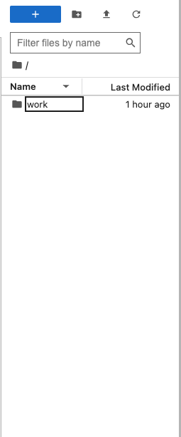

# Simple Task List with Redis

## Author info
- Author: Deep Mistry
- GitHub account: dmistry1
- UMD email: dmistry2@umd.edu

# Link to the Final Project Video
  https://drive.google.com/file/d/1zD7wqvX62ee5AI5tNiDAZ31_xGyHoLJd/view?usp=sharing
# Project Description
This app takes your basic to-do list to the next level. With features like user authentication, task categorization, and setting deadlines, it's more than just a simple task manager. It runs smoothly thanks to Redis, ensuring quick access to your tasks and user data. Plus, with Flask handling the API, managing tasks becomes easier.

## Technologies
- #### Redis
  - Redis serves as a highly efficient choice for data storage and retrieval. It excels in handling tasks such as managing user sessions, storing task information, and handling real-time updates.
  - Redis's in-memory data storage capability allows for lightning-fast access to task and user data, which is crucial for a responsive task management application. 
- #### Flask
  - Flask is a lightweight and flexible web framework for Python.
  - Flask allows developers to start with a simple application and gradually scale it up as needed. It provides the flexibility to add new features and endpoints without much overhead.
  - Flask also provides tools and extensions for easily creating RESTful APIs. This is crucial for building endpoints to handle tasks such as creating, updating, and deleting tasks in the task management application.
- #### Docker
  - Docker containers provide isolation for Redis and Flask, ensuring that they run independently of the host environment and other applications. This isolation helps prevent conflicts and ensures that each component operates reliably.
  - Docker containers encapsulate the dependencies required by Redis and Flask, making it easy to manage and version-control their environments. This simplifies dependency management and reduces the risk of compatibility issues between different versions of libraries or software components.
  - The Dockerfile utilizes an official Python runtime as the foundational image, incorporates the Redis server, and transfers both the Python script and mock database file into the container. This process culminates in a Docker image that contains the entirety of the project, facilitating seamless deployment and scalability.

## Implementation
 - #### Dockefile
     - `FROM python:3.9-slim`: Specifies the base image to use, which is the official Python image from Docker Hub with Python 3.9 installed, using the slim variant for a smaller image size.
    - `WORKDIR /app`: Sets the working directory inside the container to /app.
    - `COPY . /app`: Copies the contents of the current directory (presumably containing the Flask web application, Jupyter Notebook files, and other necessary files) into the /app directory in the container.
    - `RUN apt-get update && \ apt-get install -y redis-server && \ pip install Flask jupyter redis`: Updates the package lists for apt, installs the Redis server, and installs Python dependencies Flask, Jupyter Notebook, and Redis using pip.
    - `EXPOSE 5000 8888 6379`: Exposes the ports on which the Flask application, Jupyter Notebook, and Redis server will run, respectively.
    - `RUN jupyter notebook --generate-config && \ echo "c.NotebookApp.token = ''" >> /root/.jupyter/jupyter_notebook_config.py`: Generates a Jupyter Notebook configuration file and sets the token to an empty string to disable authentication.
    - `CMD ["bash", "-c", "service redis-server start && python app.py & jupyter notebook --ip 0.0.0.0 --no-browser --allow-root"]`: Specifies the command to run when the container starts. It starts the Redis server, runs the Flask application (app.py), and starts the Jupyter Notebook server to listen on all IP addresses (0.0.0.0) without opening a browser and allowing root access.
  - #### Docker compose
    - **Version:** Specifies the version of the Docker Compose file format being used.
    - **Services**:
      - **Flask App**:
        - Build: Specifies to build the Docker image for the Flask application using the Dockerfile in the current directory (.).
        - Ports: Maps port `5000` of the host machine to port `5000` of the container, allowing access to the Flask application.
        - Depends_on: Indicates that the Flask application container depends on the Redis container.
       - **Jupyter**:
          - Image: Specifies to use the jupyter/base-notebook image available on Docker Hub.
          - Ports: Maps port `8888` of the host machine to port `8888` of the container, enabling access to the Jupyter Notebook server.
          - Volumes: Mounts the current directory (.) to /home/jovyan/work inside the container, allowing access to files for Jupyter notebooks.
          - Environment: Sets the Jupyter token to an empty string, disabling authentication.
          - Depends_on: Indicates that the Jupyter container depends on the Redis container.
      - **Redis**:
        - Image: Specifies to use the latest version of the Redis image available on Docker Hub.
        - Ports: Maps port `6379` of the host machine to port `6379` of the container, enabling access to the Redis server.
  - #### Flask
    - First it initialzes a Flask application
    - It connects to a Redis server running on the host redis and port `6379`
    - Defines task list endpoints
      - `/register`: Allows users to register with a unique username, email, and password.
      - `/login`: Enables users to authenticate using their username and password.
      - `/tasks`: Provides endpoints for creating, retrieving, updating, and deleting tasks.
      - `/tasks/category/<category>`: Retrieves tasks based on their category.
      - `/tasks/<user_id>/<task_name>`: Retrieves a specific task based on the user ID and task name.
      - `/tasks/<task_id>`: Allows updating and deleting tasks based on their ID.

## Running Application Locally
**Building Docker Image**:

    docker compose build

**Running Docker Container**:

    docker compose up

**Accessing the Jupter Notebook Server**:
  - Navigate the link that you see in the docker running terminal
    - `Example: http://127.0.0.1:8888/lab?token=29af4339c69e2d01b2d9f01cf580f9fce7dd5c68ad7c92a0`
  - Once there, navigate to the `work` directory
  - 
  - 

**Stopping the Docker Containers**:
  - To stop containers, press `Ctrl + C` in the terminal running
        `docker-compose up`
  - Alternatively, use `docker-compose down` to stop and remove containers.

## Project Diagram

- The user's browser interacts with the frontend, which communicates with the Flask application.
- The Flask application runs inside a Docker container and serves as the backend API.
- The Flask application communicates with a Redis server running inside another Docker container for storing and retrieving user and task data.
- The Flask application exposes various API endpoints for user registration, authentication, and task management, which are handled by different parts of the Flask application.
- Redis is used as the data store for user and task information, providing fast and efficient storage and retrieval capabilities for the Flask application.

## Conclusion 
In conclusion, the architecture of the Flask application with Docker and Redis provides a robust and scalable solution for building a task management system.

- Docker containerization ensures portability, allowing the application to run consistently across different environments.
- Redis serves as a reliable and efficient data store, enabling fast storage and retrieval of user and task information.
- The Flask application serves as the backend API, handling user authentication, task creation, retrieval, updating, and deletion.
- By leveraging these technologies together, developers can create a flexible and maintainable task management system that meets the needs of users while maintaining performance and reliability.
