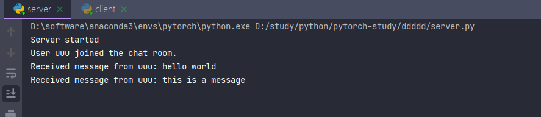
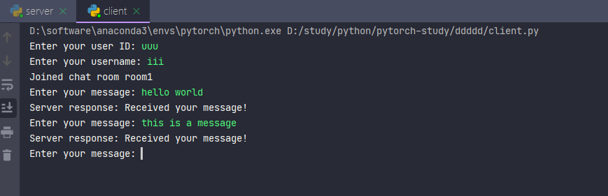

In summary, first, we will define Protocol Buffers messages and implement bidirectional streaming server-client communication using gRPC. Next, we will use Python to implement the server and client.

First, we need to define the messages that implement the service-related functionality. Suppose we want to create a simple chat application where users can send messages to a server and the server forwards these messages to other connected clients. It mainly implements the following three functions:
Chat room function: allows users to join specific chat rooms and switch between different chat rooms;
Message recording: The server can record messages in the chat room and send the recent message history to new users when they join;
User authentication: The server can authenticate users and control their access to the chat room based on their permissions.
First we have in the message definition, we have a ChatMessage, ChatRoom and User message which contains user ID, chat room and message content. Then we defined a ChatService, which has a JoinChat method that accepts a streaming ChatMessage and returns a streaming ChatMessage.
```
syntax = "proto3";

message User {
    string user_id = 1;
    string username = 2;
}

message ChatMessage {
    User user = 1;
    string message = 2;
}

message ChatRoom {
    string room_id = 1;
    repeated User users = 2;
    repeated ChatMessage history = 3;
}

service ChatService {
    rpc JoinChat (stream ChatMessage) returns (stream ChatMessage);
    rpc JoinChatRoom (stream User) returns (stream ChatRoom);
}
```
Next, we will use gRPC bidirectional streaming to implement this service. First, we need to install the Python plugin for gRPC and Protocol Buffers:
```
pip install grpcio grpcio-tools
```

Then, use the following command to compile the Protocol Buffers file into Python code:
```
python -m grpc_tools.protoc -I. --python_out=. --grpc_python_out=. chat.proto
```
Next, we will implement the functions and implementation logic of the server and client in detail. The server is mainly responsible for receiving and processing client messages, while the client is responsible for establishing a connection with the server and interacting with messages.

The server mainly implements a gRPC service, which allows the client to connect and send chat messages; the server can receive messages from the client and print them to the console; the server can handle the connections of multiple clients and receive them after receiving them. When a message arrives, it is broadcast to all connected clients.
```
import grpc
import sys
sys.path.append('..')
import chat_pb2
import chat_pb2_grpc
from concurrent import futures
import datetime


class ChatServicer(chat_pb2_grpc.ChatServiceServicer):
    def __init__(self):
        self.chat_rooms = {}

    def JoinChat(self, request_iterator, context):
        for message in request_iterator:
            # Received messages are processed here
            print(f"Received message from {message.user.user_id}: {message.message}")
            now = datetime.datetime.now()
            current_datetime = now.strftime("%Y-%m-%d %H:%M:%S")
            with open('message_history.txt', 'a') as file:
                file.write('userid: {}, userName: {}, message: {}, time: {}\n'.format(message.user.user_id, message.user.username, message.message, current_datetime))


            # Server sends message to all clients
            yield chat_pb2.ChatMessage(user=message.user, message="Received your message!")

    def JoinChatRoom(self, request_iterator, context):
        for user in request_iterator:
            # The logic for users to join the chat room is handled here.
            print(f"User {user.user_id} joined the chat room.")
            if user.user_id not in self.chat_rooms:
                self.chat_rooms[user.user_id] = chat_pb2.ChatRoom(
                    room_id="room1",
                    users=[user],
                    history=[]
                )
                now = datetime.datetime.now()
                current_datetime = now.strftime("%Y-%m-%d %H:%M:%S")
                with open('login_history.txt', 'a') as file:
                    file.write('userid: {}, userName: {}, time: {}\n'.format(user.user_id, user.username, current_datetime))

            else:
                self.chat_rooms[user.user_id].users.append(user)

            # Send chat room information and history
            for room_id, chat_room in self.chat_rooms.items():
                # print(room_id, chat_room)
                yield chat_room


def serve():
    server = grpc.server(futures.ThreadPoolExecutor(max_workers=10))
    chat_pb2_grpc.add_ChatServiceServicer_to_server(ChatServicer(), server)
    server.add_insecure_port('[::]:50051')
    server.start()
    print("Server started")
    server.wait_for_termination()


if __name__ == '__main__':
    serve()
```

First, the server-side code imports the necessary library files at the beginning. The ChatServicer class implements the gRPC service defined in the .proto file. It contains methods corresponding to service endpoints.
Any necessary data structures are initialized in the constructor. It initializes chat_rooms, which is used to store information about different chat rooms. In the JoinChat method, this method is called when the client sends a message to the server. It receives a stream of ChatMessage objects from the client, processes the messages, and sends a reply to the client.
The JoinChatRoom method is mainly used to handle the logic of the client joining the chat room. When a client joins a chat room, the server records the user in chat_rooms and broadcasts the user's joining information to all connected clients.
serve function: This function starts the gRPC server, adds an instance of the ChatServicer class to the server, and starts listening for connection requests on the specified port. Once a connection is established, the server will start receiving messages and processing them.

The main functions implemented by the client are to connect to the server and join the chat room; receive chat history from the server and display it on the client; allow users to enter messages and send them to the server; display replies from the server information.
send feedback
Sidebar
history record
Saved

```
import grpc
import chat_pb2
import chat_pb2_grpc


def send_message(stub):
    user_id = input("Enter your user ID: ")
    username = input("Enter your username: ")
    user = chat_pb2.User(user_id=user_id, username=username)
    chat_room_stream = stub.JoinChatRoom(iter([user]))
    for chat_room in chat_room_stream:
        print(f"Joined chat room {chat_room.room_id}")
        for message in chat_room.history:
            print(f"{message.user.username}: {message.message}")

    while True:
        message = input("Enter your message: ")
        chat_message = chat_pb2.ChatMessage(user=user, message=message)
        response = stub.JoinChat(iter([chat_message]))
        for resp in response:
            print(f"Server response: {resp.message}")


def main():
    channel = grpc.insecure_channel('localhost:50051')
    stub = chat_pb2_grpc.ChatServiceStub(channel)
    send_message(stub)


if __name__ == '__main__':
    main()

```
Likewise, the client first imports the necessary library files, including grpc, your_proto_file_pb2, and your_proto_file_pb2_grpc.
The send_message function handles the logic of sending messages from the client. First, it asks the user for a user ID and user name, and creates a User object with this information. It then sends user information to the server and receives chat room information and history from the server. Next, it loops and waits for the user to enter a message and sends it to the server. Finally, it displays the reply message from the server.
The main function is the entry point of the client. It creates a gRPC channel and uses that channel to create a server-side stub. Then, it calls the send_message function to handle the message sending and receiving logic.
The specific operation process is as follows:
First use the command python server.py to start the server service, and then use the command python client.py to start the client service. After starting the client, the Enter your user ID: prompt statement will appear, and then the user needs to use the keyboard to enter his or her ID and press Enter. The Enter your username: prompt statement will appear. The user needs to enter his or her username, and then the server will automatically assign a server room and store the user's login record. Then the client can enter a message, and the server will save the chat record after receiving the message.
The server interface is as follows:

The client interface is as follows:

