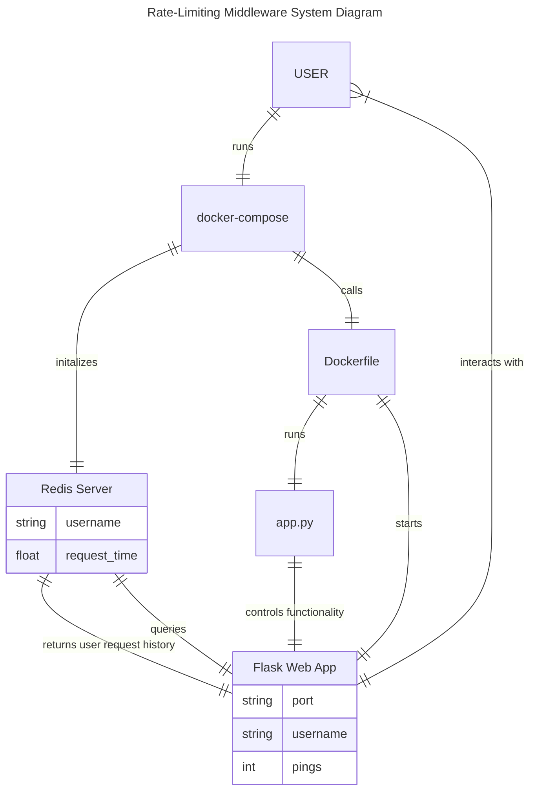

# Basic Rate Limiting Middleware with Redis

## Short Description of Technology Used

This project uses Python, Docker, Flask, and Redis to build a basic piece of rate-limiting middleware for an example web application. Docker enables the containerization of applications, isolating them from the underlying operating system through a layer of virtualization. While there are other technologies for building containers, such as Buildah and LXD, Docker is generally preferred and more widely known. Kubernetes has also become very popular in recent years, however that is a technology primarily designed for large-scale container deployment, not the building of containers. Docker provides the ability to both create and deploy/maintain containers, which helps keep development streamlined. As discussed in class, using containers provides a fast and portable method of running applications, which comes at the cost of increased CPU overhead and development workload. 
Flask is an incredibly simple Python-based framework for building web applications. This simplicity is the primary feature of Flask, as it does not require any specialized libraries and lacks any form of database abstraction or form validation. The primary alternative to Flask for Python-based web applications is Django, a web application framework with far more features and a focus on automation (source: https://towardsdatascience.com/python-web-framework-a-detailed-list-of-web-frameworks-in-python-1916d3c6222d). The simplicity of Flask is its primary selling point, as one can build a simple HTML webpage in only a few lines of Python code. This makes it easier to prototype ones code and debug connections between the web application and other components of the project, such as the Redis database. The cost of this simplicity is an inability to scale easily, a lack of full-stack capabilities, and less interactivity on the user side. 
Redis is an in-memory, noSQL database, designed for applications that require the ability to cache data. While Redis is a relatively poor choice for long-term storage, due to its limited persistence capabilities, it has very fast read/write times, making it an ideal choice for short-term temporary storage (source: https://redis.io/about/). These attributes are why it was selected as the database for this project, as the rate-limiter only needs to track user activity while the service is active. If the service goes offline then there are no users who would need to be restricted from using the service, rendering data persistence unnecessary. Because the rate-limiter built in this project has to be able to identify and restrict frequent queries, it makes more sense to use a low latency database like Redis instead of a slower and more robust SQL-based database. 
Python was chosen as the primary programming language because Flask was chosen as the framework for building the example web application. Python is also well supported by Redis and Docker, making it a natural choice for this project. While there are other programming languages that could be used to achieve a similar end-product, such as Java, the author's familiarity with Python and lack of expertise in these other languages further informed the decision.

## Docker System Explanation

The system for this project consists of two Docker containers which are run together using a docker-compose YAML file. The first of these containers is defined by the custom Dockerfile written for this project. This Dockerfile begins by referencing a pre-built Python Docker Image, in this case "python:3.8-slim-buster". This image contains all of the python functionality needed to run our Flask app and the functionality inside it. The Dockerfile then sets the work directory to "/python-docker", providing an environment for our system to operate within. It then copies "requirements.txt" from the directory containing the Dockerfile to the working directory, so that the next command can be run, "RUN pip3 install -r requirements.txt". This command goes through the requirements text file and attempts to install each of the packages specified within, ensuring that our application has all the functionality it requires no matter where the system is run from. The next copy command also supports this goal, ensuring that everything installed is placed into the correct directory. Finally the Dockerfile runs "python3 -m flask run --host=0.0.0.0" on the command line, which initializes the Flask application on the user's localhost port. As outlined above, this container is used to initialize the Python and Flask aspects of the system: the other container is used to initialize the Redis server used by the system.

The docker-compose YAML file specifies that the "redis:alpine" image be spun up once the application is launched. This image is one of the official Redis Docker images, and creates a Redis instance that our application will connect to for storing rate-limiting data. The Redis alpine image is used instead of the typical Redis image because it is a much smaller image, enabling this project to be as lightweight as possible. Since this is a proof-of-concept project, we are not interested in any potential additional functionality that the standard distribution would offer, guiding our decision to use this streamlined version instead. 

## Operation (How to Run the System)

The user should begin by using "git clone" or "git pull" to download the project files onto their machine. Once this has been done, navigate to the directory containing the project files using the appropriate "cd" commands. Next, the user should run "docker-compose up --build" in their terminal. This creates the Docker container with a Flask web application running on the user's localhost port connected to a Redis server. As outlined above, this docker-compose command invokes both the custom Dockerfile created for this project and an official Redis image, in addition to connecting to the user's localhost ports. Upon running the command the user should see a rapid progression of text in their terminal, first detailing all of the various components of the container that are being built, followed by messages from the Redis server initializing. Once the user sees "WARNING: This is a development server. Do not use it in a production deployment. Use a production WSGI server instead." followed by "running on all addresses", the application is officially up and running. 

At this point the user should open a web browser of their choice and navigate to localhost:5000/ (alternatively they can open 0.0.0.0:5000/, these two addresses are functionally identical). Once there, they will be greeted with a basic HTML webpage titled "Welcome to the sandbox". Below this heading are two textboxes with submission buttons, one titled "Username:" and the other titled "How many times would you like to ping the server?".  The user can enter a username in the first field and hit submit if they so desire: if they do not provide a username before pinging the server, they will be doing so as the default user (in the case of this project, the default username is "admin"). The user can then specify an integer number of times that they would like to ping the server: if the user enters a low number (~5), the requests will go through and the page will simply refresh to its initial state. If the user attempts to ping the server too many times, however (>10), the rate-limiting will instead take effect and show the user a page stating "[USERNAME] IS BLOCKED". This rate-limiting will also take effect if the user attempts to send multiple pings to the server under the same username in quick succession. If small ping requests are sent from different usernames, however, none of the users will be blocked, as the rate-limiting is specific to the user pinging the server. While this is clearly a simplified example of rate-limiting middleware and not one that should be deployed in a production environment, it is sufficient to demonstrate how one can be built and what technologies are required. 

## Detailed Explanation

As previously mentioned, this project consists of a containerized application that connects a Redis server to a Flask web app that opens on the user's localhost port. These components are created by running a docker-compose command, which references the appropriate Docker images and ports to begin running the application. The overall architecture of the application can be seen in the below Mermaid diagram:

As previously mentioned in the Technology Description section, Redis is an in-memory, NoSQL database, providing it with lots of flexibility in how data is stored and represented. In this project, the two primary pieces of information stored in the database are usernames and their associated request history. These are stored as dictionary key-value pairs in the Redis server, enabling very fast read/write times. This low latency is key for middleware applications such as this project, which often must integrate into complex systems of applications without significant computational overhead. 

The bulk of this project's functionality is contained within app.py, the Python script that controls the Flask web application and how it interacts with the Redis server. The script begins by importing all of the needed libraries; Flask, Redis, and timedelta from the datetime library. The purpose of these libraries are self-explanatory, considering the use of Flask, Redis, and time differences in this project. After the import statements, a connection to the Redis server is stored in the variable r. This connection will be used to communicate with the Redis server to determine whether a specific user should be rate-limited or not. A goal for this project beyond the initial scope of requirements was the enable rate-limiting on a user-specific basis. After all, denying all users access to a service because a single user is sending too many requests is the definition of a denial-of-service (DoS) attack, something rate-limiting middleware typically aims to defend against. However, the simplicity of Flask made implementing this functionality difficult, as the username variable entered by the user would be overwritten when the user attempted to ping the server, causing all pings to be made from the default username. To circumvent this limitation, a global variable is created called user_history, which is an ordered list of usernames entered on the web page. The exact implementation will be covered in further detail later, but this creates a level of persistence for usernames, enabling user-specific rate-limiting. 

The next section of app.py is the specific rate-limiting function employed in this project. The code for this function is sourced from Andrea Stagi's dev.to page (https://dev.to/astagi/rate-limiting-using-python-and-redis-58gk) and employs the Generic Cell Rate Algorithm (GCRA) to rate-limiting. This algorithm enables rate-limiting of both bunched and spread requests, taking a redis server, username, request limit, and time period as inputs. If the requests are bunched, then rate-limiting occurs if the number of requests exceeds the limit specified. If the requests are spread, then the algorithm calculates a maximum request rate equal to the limit divided by the specified time period, and rate-limits the user if their requests are occurring at a more frequent rate. This is achieved by storing the user's request times in the Redis database, which are then retrieved, used in the algorithm, and updated if needed each time the user makes a request. This process is user-specific because the username and request times are stored as a key-value pair in the Redis database, enabling each user's request history to be tracked and calculated separately. The function also employs a Lua-based lock to prevent errors with retrieving and modifying values in the Redis database if multiple requests are occurring simultaneously. 

With our rate-limiting function defined, we can return to the body of app.py, beginning with the Flask app being created. The @app.route('/') wrapper specifies that the following code will control what happens on the default landing page of the Flask web app, which is the only webpage defined in this project. The hello function is invoked whenever this page is loaded or refreshed, and begins by using a get request to retrieve the previously entered username. If no username has been previously entered (e.g. the first time the page is loaded) then the username variable defaults to "guest". If a username has been entered, however, this username is appended to our user_history list for use later. A similar get request is used to determine the number of times to ping the server, with the default value being 1. A boolean flag variable is used to determine whether or not the current user is rate-limited, with this variable always initialized to False, as users should not be rate-limited until after the rate-limiting function is run. Next a for loop is used to iterate through the user-specified number of pings, checking each time to see whether the user should be rate-limited according to the previously specified function. If the user does send too many pings then the block flag is flipped to True, causing the user to be shown a plain HTML webpage saying "[Username] IS BLOCKED". If the user is not rate-limited, however, they are shown the default HTML landing page with the two forms for them to enter their username and how many times they would like to ping the server. This relatively short Python script contains nearly all the functionality of this project, specifying how the users interact with the Flask web app as well as how the rate-limiting middleware works. 