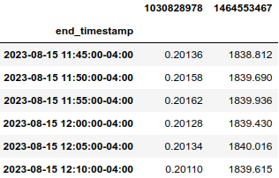

<!-- toc -->

- [Converting a string into a Pandas df](#converting-a-string-into-a-pandas-df)
  * [Rationale](#rationale)
  * [How to use](#how-to-use)
    + [Notes](#notes)

<!-- tocstop -->

# Converting a string into a Pandas df

## Rationale

Standard ways to construct a Pandas dataframe from data (e.g., from a dict or a
list of lists) are extremely cumbersome, especially for longer dataframes with
many rows. Our goal is to introduce a tool that allows to create a Pandas
dataframe from its string representation, which is much more readable.

Compare the data needed to create a df in a standard way:

```python
data = {
    1030828978: [0.20136, 0.20158, 0.20162, 0.20128, 0.20134, 0.20110],
    1464553467: [
        1838.812,
        1839.690,
        1839.936,
        1839.430,
        1840.016,
        1839.615,
    ]
}
timestamps = pd.date_range(
    start="2023-08-15 11:45:00",
    end="2023-08-15 12:10:00",
    tz="America/New_York",
    freq="5T",
)
```

To the data needed to create a df with our tool:

```python
df_as_str = """
                               1030828978  1464553467
end_timestamp
"2023-08-15 11:45:00-04:00"     0.20136    1838.812
"2023-08-15 11:50:00-04:00"     0.20158    1839.690
"2023-08-15 11:55:00-04:00"     0.20162    1839.936
"2023-08-15 12:00:00-04:00"     0.20128    1839.430
"2023-08-15 12:05:00-04:00"     0.20134    1840.016
"2023-08-15 12:10:00-04:00"     0.20110    1839.615"""
```

## How to use

- The function is `str_to_df()`, located in `helpers/hpandas.py`
- To use the function, one needs to provide a string representation of the df
  and the mappings between the columns and the desired types of column names and
  values
- For example, given the string representation of a df in the previous section
  and the following mappings:

```python
col_to_type = {
    "__index__": pd.Timestamp,
    "1030828978": float,
    "1464553467": float,
}
col_to_name_type = {
    "1030828978": int,
    "1464553467": int,
}
```

`str_to_df()` will output the following dataframe:

<kbd></kbd>

- More usage examples can be found, e.g.:
  - In the dedicated unit tests in
    `helpers/test/test_hpandas.py::Test_str_to_df`
  - In practical use cases in `oms/order/test/test_order_converter.py`

### Notes

- The string representation used as an input to the function should be largely
  the same as the output of `hpandas.df_to_str()`. Note that it is not the same
  as the output of `str()`, which is much less controlled and therefore messier
  than of `df_to_str()` (e.g., the column names are often split into different
  rows far away from each other, etc)
- There are several differences between the raw output of `df_to_str()` and the
  required format of the input to `str_to_df()`:
  - If the number of rows is over a certain number, then `df_to_str()` cuts
    them, leaving only the head and the tail of the df, and everything in
    between is replaced by the "[...]" placeholder. In `str_to_df()`, the
    placeholder "[...]" is simply removed and the data it stands for cannot be
    restored
  - In the input to `str_to_df()`, values that contain spaces (e.g., a timestamp
    like "2000-01-01 09:00:00") need to be enclosed in double quotation marks.
    If there are values with spaces in the input to `df_to_str()`, then it will
    convert them into strings but will not automatically put quotation marks
    around them, which means that if we attempt to convert the output string
    back into a df with `str_to_df()` without adding the quotation marks
    manually, these values will be split into two different columns, possibly
    also breaking the whole process due to the column number mismatch
