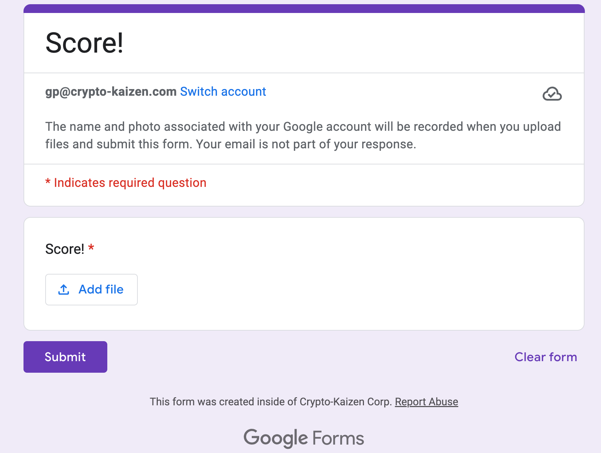

# Contributor Scoring

<!-- toc -->

- [Scoring process](#scoring-process)
  * [General](#general)
  * [Current process](#current-process)
- [Scoring topics](#scoring-topics)
  * [General](#general-1)
  * [Current topics](#current-topics)
  * [Roles](#roles)
  * [More detailed topics for candidate full- and part-time](#more-detailed-topics-for-candidate-full--and-part-time)
    + [Technical](#technical)
    + [Process-related](#process-related)

<!-- tocstop -->

## Scoring process

### General

- We want to evaluate and provide feedback to our team members on different aspects of their work.

- We don't take non-perfect scores personally but just as a way to understand what to improve.

- The scoring template is here
[Scoring template](https://docs.google.com/spreadsheets/u/2/d/1WsWT8By2hr1VqB6ulIXf3_Rfa0zE2KHI/edit?usp=drive_web&ouid=106425005676808098789&rtpof=true) (this is an Excel spreadsheet since you need to upload it and it needs to be a file and not a Google Sheet).

- Each metric is scored between 1 (poor), 3 (average) and 5 (excellent)

  - We consider 4 as acceptable, anything less than 4 as problematic and needs improve

- We want to score everyone we work with:

  - Initially only people that we supervise, later on anyone
  - Feedback is anonymous
  - At least 2 persons should score everyone

- Scoring frequency

  - Every 2 weeks for full-time candidates, part-time collaborators
  - Every month for full-time team

### Current process

- Every scoring needs to happen (e.g., every two weeks):

  - Mentor make a copy of the Excel spreadsheet [Scoring template](https://docs.google.com/spreadsheets/u/2/d/1WsWT8By2hr1VqB6ulIXf3_Rfa0zE2KHI/edit?usp=drive_web&ouid=106425005676808098789&rtpof=true)
  - Rename the template "Scoring - {Scorer} - {ScoringDate}" (e.g., "Scoring - GP - 2023-09-01")
  - Fill out the rows for the people that they need to score by looking at the Mentor column
  - Upload your Scoring Excel file [here](https://docs.google.com/forms/d/e/1FAIpQLSdXhjHo52Roz_ROY-zlkg0YPMHCzoDXmPpCd1x-KmeCtQVd5g/viewform)
    - You should see
    - 
    - (For admin use, the source is [here](https://docs.google.com/forms/d/1IXpcMSrtVI0xO3eNMrzGNJ0zpv-KySQVXjujlSuZlpo/edit)
      and [here](https://drive.google.com/drive/u/1/folders/1r-npms62yEvO90bXq8yZ99MkQk21c6SrQ5PpT1KqLpF1cnUqwJgO8E7cuD2t6zZe2P3hwjbe))

  - One of the integrators (GP, Paul, or somebody else) merges all the scoring template in a single one, and then creates the averaged score for each person
  - The scores are then distributed anonymously
    - Scored team members don't know who / how many mentors scored them (although they have a clue about at least one mentor)

## Scoring topics

### General

- Topics should be independent

- We should provide

  - Concrete questions to assess how people do on each topic
  - Ways to improve the score (e.g., "read this book!", "do more of this and less of this")

### Current topics

- Scoring table contains the following fields:

  - Quality of code
    - Writes elegant code?
    - Follows our standards and conventions?
    - Designs beautiful abstractions, when needed?
  - Quality of design
    - Designs beautiful but simple abstractions?
    - Adds abstractions only when needed?
    - Orchestrates software components properly?
    - Uses design patterns, when needed?
  - Attention to details
    - Thinks in terms of corner cases?
    - Debugs things carefully?
    - Takes pride in well-done product (e.g., code, documentation)?
  - Productivity
    - Closes issues effectively without unnecessary iterations?
    - It is a qualitative measure of progress per unit of time
  - Make and achieve ETAs
    - Estimates complexity in bugs?
    - Thinks of risks and unknown unknowns, best / average / worst ETAs?
    - Resolves issues in set ETAs?
    - Puts in a sufficient amount of hours to make progress?
  - Autonomy
    - Understands specs?
    - Needs a lot of supervision to execute the tasks?
    - Does what's right according to our shared way of doing things without
      reminders?
  - Follow our PR process
    - Learns from reviews and doesn't make the same mistakes?
    - Runs linter consistently before each iteration?
    - Does a PR / day (even draft)?
  - Follow our organizational process
    - Sends a daily TODO email?
    - Updates their issues daily?
    - Curates GitHub / ZenHub?
  - Team work
    - Helps others on the team when others need help / supervision?
    - Takes the initiative and goes the extra mile when needed?
    - Sacrifices for the greater good (e.g., doing stuff that is not fun to do)?
  - Communication
    - Files issues with clear specs?
    - Explains technical issues and gives updates properly and with clarity?
    - Reports problems and solutions with proper context?
    - Speaks and writes English well?
  - Ability to run a team
    - Can juggle multiple topics at once?
    - Can split the work in specs?
    - Is it ok with being interrupted to help team members?
  - Positive energy
    - Has an upbeat approach to working even if sh\*t doesn't work (since things
      never work)?
    - Is a [Negative Nelly](https://www.urbandictionary.com/define.php?term=negative%20nelly)?
  - Dev %, Data scientist %, Devops %
    - This just measures how much of a role one team member can cover
    - See below

### Roles

- We want to define how each team-member is comfortable covering several high level activities.

- The idea is to understand what roles a new hire can play.

- Roles are not mutually exclusive

  - E.g., a jack-of-all-trades can be 4 on all topics
  - E.g., XYZ is a data scientist and has data science=5, dev=3, devops=1
  - Data science
    - Example of activities are:
      - Write notebooks
      - Do research
      - Debug data
  - Dev
    - Example of activities are:
      - Write code
      - Refactor code
      - Architecture code
      - Debug code
      - Unit test code
  - DevOps
    - Example of activities are:
      - Manage / supervise infra
      - Airflow
      - Docker
      - AWS
      - Administer Linux

### More detailed topics for candidate full- and part-time

- When interviewing a candidate / collaborator we want to have more topics

#### Technical

- Unit testing
  - Does he / she write good unit tests?
  - Does he / she use coverage to understand what / how to test?
- Git / GitHub knowledge
- Linux knowledge
- Review churning
  - Do the reviews take too long?
- Python knowledge / coding ability

#### Process-related

- Send good TODO email
- Follow our PR process
- Read the docs with attention
- Follow our organizational process
- Make and achieve ETAs
- Autonomy / Independence
  - Does he / she need a lot of supervision to execute the tasks?
- Productivity
- Number of hours
  - This is a minor metric: the number of hours doesn't really matter as long as
    stuff is done
  - On the other hand, if somebody consistently doesn't put enough time to get
    the needed stuff done, it can become a problem