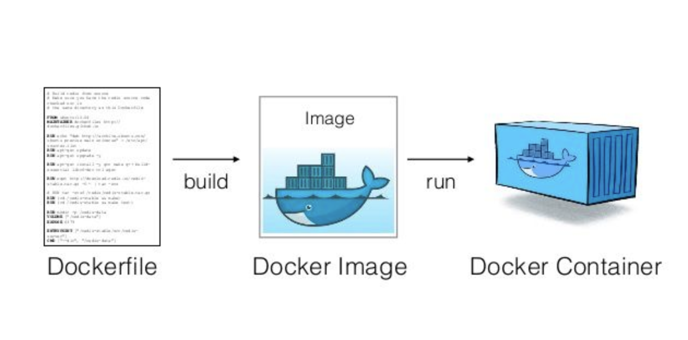

# Docker

<!-- toc -->

- [Introduction](#introduction)
- [Concepts](#concepts)
  * [Docker image](#docker-image)
  * [Docker container](#docker-container)
  * [Docker registry](#docker-registry)
- [High level philosophy](#high-level-philosophy)
  * [Thin client](#thin-client)
  * [amp / cmamp container](#amp--cmamp-container)
  * [Prod container](#prod-container)
  * [Infra container](#infra-container)
  * [Relevant bugs](#relevant-bugs)
- [Poetry](#poetry)
- [Build a Docker image](#build-a-docker-image)
  * [General](#general)
  * [Dockerfile](#dockerfile)
    + [Base image](#base-image)
    + [Copy files](#copy-files)
    + [Install OS packages](#install-os-packages)
    + [Install Python packages](#install-python-packages)
  * [Build an image from a Dockerfile](#build-an-image-from-a-dockerfile)
- [Run multi-container Docker application](#run-multi-container-docker-application)
  * [Version](#version)
  * [Images](#images)
  * [Bind mount](#bind-mount)
  * [Environment variables](#environment-variables)
  * [Basic commands](#basic-commands)
- [How to test a package in a Docker container](#how-to-test-a-package-in-a-docker-container)
  * [Hacky approach to patch up a container](#hacky-approach-to-patch-up-a-container)
- [How to release a Docker image](#how-to-release-a-docker-image)
  * [Multi-architecture build](#multi-architecture-build)
    + [Run the dev multi-architecture image release end-to-end](#run-the-dev-multi-architecture-image-release-end-to-end)
      - [Overview](#overview)
      - [Pre-release check-list](#pre-release-check-list)
      - [Command to run the release flow:](#command-to-run-the-release-flow)
      - [Post-release check-list](#post-release-check-list)
  * [Stages](#stages)
    + [Local](#local)
    + [Dev](#dev)
    + [Prod](#prod)
  * [Overview of how to release an image](#overview-of-how-to-release-an-image)
  * [How to add a Python package to Docker image](#how-to-add-a-python-package-to-docker-image)
  * [How to find unused packages](#how-to-find-unused-packages)
    + [Import-based approach using `pipreqs`](#import-based-approach-using-pipreqs)
      - [How it works](#how-it-works)
      - [Limitations](#limitations)
      - [Usage](#usage)
  * [How to build a local image](#how-to-build-a-local-image)
  * [Testing the local image](#testing-the-local-image)
  * [Pass the local image to another user for testing](#pass-the-local-image-to-another-user-for-testing)
  * [Tag `local` image as `dev`](#tag-local-image-as-dev)
  * [Push image](#push-image)
  * [End-to-end flow for `dev` image](#end-to-end-flow-for-dev-image)
  * [Build prod image](#build-prod-image)
  * [QA for prod image](#qa-for-prod-image)
  * [End-to-end flow for `prod` image](#end-to-end-flow-for-prod-image)
  * [Flow for both dev and prod images](#flow-for-both-dev-and-prod-images)
- [Docker-in-docker (dind)](#docker-in-docker-dind)
  * [Sibling container approach](#sibling-container-approach)
    + [Connecting to Postgres instance using sibling containers](#connecting-to-postgres-instance-using-sibling-containers)
- [Release flow](#release-flow)
  * [cmamp](#cmamp)
  * [dev_tools](#dev_tools)
- [Design release flow - discussion](#design-release-flow---discussion)
  * [QA flow](#qa-flow)
- [Dev_tools container](#dev_tools-container)
- [Optimizer container](#optimizer-container)
  * [Rationale](#rationale)
  * [Build and run a local version of `opt`](#build-and-run-a-local-version-of-opt)
  * [Internals](#internals)
    + [One container per Git repo](#one-container-per-git-repo)
    + [Multiple containers per Git repo](#multiple-containers-per-git-repo)
      - [Mounting only `optimizer` dir inside Docker](#mounting-only-optimizer-dir-inside-docker)
      - [Mounting the supermodule (e.g., lime, lemonade, amp) inside Docker](#mounting-the-supermodule-eg-lime-lemonade-amp-inside-docker)
  * [Invariants](#invariants)
  * [Release and ECR flow](#release-and-ecr-flow)
  * [Unit testing code inside `opt` container](#unit-testing-code-inside-opt-container)
    + [Avoid compiling code depending from cvxopt when running amp](#avoid-compiling-code-depending-from-cvxopt-when-running-amp)
    + [Run optimizer tests in a stand-alone `opt` container](#run-optimizer-tests-in-a-stand-alone-opt-container)
    + [Run optimizer tests as part of running unit tests for `cmamp`](#run-optimizer-tests-as-part-of-running-unit-tests-for-cmamp)
  * [Call a Dockerized executable from a container](#call-a-dockerized-executable-from-a-container)

<!-- tocstop -->

TODO(Sameep): Update the doc by replacing `sorrentum` with `kaizenflow` once docker is updated.

# Introduction

- Docker is an open-source tool designed to make our life typically easier
  (although sometimes it makes it harder) when creating, building, deploying,
  and running software applications.
- Docker can package an application and its dependencies in a virtual container
  that can run on any Linux, Windows, or macOS computer.
- Our Docker containers have everything required (e.g. OS packages, Python
  packages) inside to run certain applications/code.

# Concepts

## Docker image

- A Docker image is a read-only template with instructions for creating a Docker
  container
- Typically instructions include information about which packages and their
  versions to install, e.g. list of python packages and their corresponding
  versions
- All steps needed to create the image and run it are defined in a Dockerfile,
  e.g. `dev_tools/devops/docker_build/dev.Dockerfile`

## Docker container

- A Docker container is a runnable instance of an image. One can run code inside
  a docker container having all requirements installed.

## Docker registry

- A Docker registry stores docker images. In other words, Docker registry for
  docker images is like GitHub for code.

# High level philosophy

- We always want to separate things that don't need to run together in different
  containers (e.g., `dev / prod cmamp`, `optimizer`, `im`, `oms`, `dev_tools`),
  along a logic of "independently runnable / deployable directories".
- The problem is that when we put too many dependencies in a single container,
  trying to simplify the release approach we start having huge containers that
  are difficult to deploy and are unstable in terms of building even using
  `poetry`.
- Each dir that can be "deployed" and run should have a `devops` dir to build /
  qa / release containers with all the needed dependencies
- Certain containers that need to be widely available to the team and deployed
  go through the release process and ECR
- Other containers that are lightweight and used only by one person (e.g., the
  `infra` container) can be built on the fly using
  `docker compose`/`docker build`.

## Thin client

- To bootstrap the system we use a "thin client" which installs in a virtual env
  the minimum set of packages to run (e.g., installs `invoke`, `docker`, etc).
- TODO(gp): Audit / make sure we can simplify the thin env

## amp / cmamp container

- The `dev` version is used to develop
- The `prod` version can be used for deployment as shortcut to creating a
  smaller container with only the strictly needed dependencies

## Prod container

- In order to avoid shipping the monster cmamp dev / prod container, we want to
  start building smaller containers with only the dependencies that specific
  prod scripts need

## Infra container

1. To run infra script, if we only need `boto3` and `moto`, we can
   - Create a Python library
   - Create a script interface
   - Create an `invoke` task that calls `i docker_cmd --cmd ...` reusing the
     cmamp container, (since that container already has `boto3` and `moto` that
     are dependencies we can't remove)
     - This approach is similar to calling the `linter`
2. If we think we need to add new packages only for running infra scripts then
   we will create a new `infra` container.
   - We can build on the fly and not release through ECR

- We can start with approach 1, which will also allow us to transition to 2
  transparently, if needed

## Relevant bugs

- [https://github.com/cryptokaizen/cmamp/issues/1060](https://github.com/cryptokaizen/cmamp/issues/1060)
- Tool to extract the dependency from a project #1038
- Create tool for poetry debugging #1026
- Fix tests that fail due to pandas update and release cmamp image #1002

# Poetry

- Poetry is a tool for managing Python packages and dependencies:
  - List packages you want to install with some constraints, e.g., `pandas` must
    be above 1.0 in `devops/docker_build/pyproject.toml`
  - Given a list of packages you need to install to get the desired environment,
    you want `poetry` to "optimize" the packages and generate
    `devops/docker_build/poetry.lock`, which contains the list of versions of
    the packages to install
  - If there is a new version of a package re-running `poetry` might give you an
    updated list of packages to install

# Build a Docker image

## General

- A docker image is built from a `Dockerfile`. The image is then used to run a
  Docker container.

  

- There is `/devops` dir under a project's dir that contains Docker-related
  files, e.g. `cmamp/devops`.

## Dockerfile

- A `Dockerfile` is a text document that contains all the commands to call on
  the command line to assemble an image. E.g.
  `cmamp/devops/docker_build/dev.Dockerfile`.

### Base image

- A `Dockerfile` should start with specifying a base image.
- Base image is an image that a new image is built from. A new Docker image will
  have all the packages/dependencies that are installed in the base image.
- Use `FROM` statement to specify a base image, e.g.
  ```
  FROM ubuntu:20.4
  ```

### Copy files

- Copy files that are required to build a Docker image to the Docker filesystem.
- To copy a file from `/source_dir` (your filesystem) to `/dst_dir` (Docker
  filesystem) do:
  ```
  COPY source_dir/file dst_dir
  ```
- E.g., the command below will copy `install_packages.sh` from
  `devops/docker_build` to the Docker's root directory so that
  `install_packages.sh` can be accessed by Docker.
  ```
  COPY devops/docker_build/install_packages.sh .
  ```

### Install OS packages

- Install OS packages that are needed for a Docker app, but that are not
  installed for a base image.
- Use `RUN` instruction to install a package, e.g.
  ```
  RUN apt-get install postgresql-client
  ```
- Alternatively you can package all installation instructions in a `.sh` file
  and run it. Do not forget to copy a `.sh` file to the Docker filesystem so
  that Docker can see it. E.g.,
  ```
  COPY devops/docker_build/install_packages.sh .
  RUN /bin/sh -c "./install_packages.sh"
  ```

### Install Python packages

- We prefer to install Python packages with `poetry`.
- Make sure that there is instruction to install `pip3` and `poetry`. You can
  either put it in a `Dockerfile` or in a separate file like
  `install_packages.sh`.
  ```
  RUN apt-get install python3-pip
  RUN pip3 install poetry
  ```
- Copy poetry-related files to the Docker filesystem so that files can be
  accessed by Docker
  ```
  COPY devops/docker_build/poetry.toml
  COPY devops/docker_build/poetry.lock
  ```
- Update Python packages
  ```
  RUN poetry install
  ```

## Build an image from a Dockerfile

- To build an image from a `Dockerfile` run:
  ```
  > docker build .
  ```
- The `Dockerfile` must be called `Dockerfile` and located in the root of the
  context.
- You can point to any `Dockerfile` by using `-f`:
  ```
  > docker build -f /path_to_dockerfile/dockerfile_name
  ```

# Run multi-container Docker application

- Compose is a tool for defining and running multi-container Docker
  applications. With Compose, you use a `YAML` file to configure your
  application's services.

  

## Version

- At the beginning of a `docker-compose.yaml` file specify the `docker-compose`
  version. We use the version `3.0`, for more information see
  [the official documents](https://docs.docker.com/compose/compose-file/compose-versioning/).
  ```
  version: "3.0"
  ```

## Images

- You can either re-use a public image or build a new one from a `Dockerfile`.
- The `app` service below uses the image that is built from the
  `dev.Dockerfile`.
  ```
  app:
    build:
      context: .
      dockerfile: dev.Dockerfile
  ```
- The `im_postgres_local` service below uses the public `postgres` image pulled
  from the [Docker hub registry](https://hub.docker.com/_/postgres).
  ```
  im_postgres_local:
    image: postgres: 13
  ```

## Bind mount

- If you want to be able to access code inside a Docker container, you should
  bind-mount a directory with the code on the host.
- Mount a directory on the host inside a Docker container, e.g. mount current
  directory to `/app` dir inside a Docker container:
  ```
  app:
    volumes:
      - .:/app
  ```

## Environment variables

- You can either use variables directly from the environment or pass them in a
  `docker-compose.yaml` file.
- It is supposed that `POSTGRES_VERSION` is already defined in the shell.
  ```
  db:
    image: "postgres:${POSTGRES_VERSION}"
  ```
- Set environment variable in a service's container
  ```
  db:
    environment:
      - POSTGRES_VERSION=13
      image: "postgres:${POSTGRES_VERSION}"
  ```
- Set environment variable with `.env` file
  ```
  db:
    env_file:
      - ./postgres_env.env
      image: "postgres:${POSTGRES_VERSION}"
  ```
- File `postgres_env.env`
  ```
  > cat ./postgres_env.env
  POSTGRES_VERSION=13
  ```

## Basic commands

- To check more advanced usage, please see
  [the official documentation.](https://docs.docker.com/compose/reference/)
- Build, (re)create, start, and attach to containers for a service. It is
  assumed that a `docker-compose` file has the name `docker-compose.yaml` and is
  located in the current dir.
  ```
  > docker-compose up
  ```
- List containers
  ```
  > docker-compose ps
  ```
- Stop containers created by `down`.
  ```
  > docker-compose down
  ```

# How to test a package in a Docker container
```
> sudo /bin/bash -c "(source /venv/bin/activate; pip install yfinance)"
> python -c "import finance"
```

## Hacky approach to patch up a container
```
# After install create a new version of the container
> docker commit d2916dd5f122
> 623860924167.dkr.ecr.eu-north-1.amazonaws.com/cmamp:dev_ccxtpr

# Push to the repo
> docker push 623860924167.dkr.ecr.eu-north-1.amazonaws.com/cmamp:dev_ccxtpro

# Then you can push and pull on different machines
> docker pull 623860924167.dkr.ecr.eu-north-1.amazonaws.com/cmamp:dev_ccxtpro

# To use `docker_bash` you might need to retag it to match what the system expects
> docker tag 623860924167.dkr.ecr.eu-north-1.amazonaws.com/cmamp:dev_ccxtpro
```

# How to release a Docker image

- All the `invoke` tasks to run the release flow are in
  `//amp/helpers/lib_tasks.py`.
- Depending on the type of changes sometimes one needs to rebuild only the
  `prod` image, other times one needs to rebuild also the `dev` image.
- E.g.,
  - If you change Docker build-related things (e.g., add a Python package), you
    need to rebuild the `dev` image and then the `prod` image from the `dev`
    image
  - If you change the code for a production system, you need to create a new
    `prod` image
- We try to use the same flow, conventions, and code for all the containers
  (e.g., amp, cmamp, dev_tools, opt).

## Multi-architecture build

- To build multi-arch (e.g., `x86`, `arm`) docker image using
  `docker_build_local_image` we should use `--multi-build` flag
  - To build for specific platforms specify the platform name:
    - For `x86` - `linux/amd64`
    - For `arm` - `linux/arm64`
      ```
      > i docker_build_local_image --version <VERSION> --multi-build --platform <PLATFORM NAME>
      ```
  - To build for both `arm` and `x86` architectures:
    ```
    > i docker_build_local_image --version <VERSION> --multi-build --platform linux/amd64,linux/arm64
    ```
  - Multi-arch images are built using `docker buildx` which do not generate any
    local image by default
  - Images are pushed to the remote registry and pulled for testing and usage
  - To tag the local image as dev and push it to the target registry: e.g.,
    TODO(Sameep): Update to `dockerhub.kaizenflow` once docker is updated
    `aws_ecr.ck` or `dockerhub.sorrentum` , use
    ```
    > i docker_tag_push_multi_build_local_image_as_dev --version <VERSION> --target <TARGET>
    ```
  - Once the image has been successfully pushed to both ECR and DockerHub
    registries, the subsequent step involves pushing the `dev` image to GHCR
    registry. However, this action currently requires manual execution due to
    restricted access
    - Access to the `cryptokaizen` packages is limited. To gain access, kindly
      reach out to GP or Juraj
    - To proceed, perform a Docker login using your GitHub username and PAT
      (Personal Access Token):
      ```bash
      > docker login ghcr.io -u <username>
      ```
    - Tag the `dev` image to the GHCR namespace:
      ```bash
      > docker tag 623860924167.dkr.ecr.eu-north-1.amazonaws.com/cmamp:dev ghcr.io/cryptokaizen/cmamp:dev
      ```
    - Push the tagged image to the GHCR registry:
      ```bash
      > docker push ghcr.io/cryptokaizen/cmamp:dev
      ```

### Run the dev multi-architecture image release end-to-end

#### Overview

- Update the `changelog.txt` file with description of new version
- Build "local" image remotely in the CK AWS ECR registry and pull once it is
  built
- Run the `cmamp` regressions using a local image
- Run QA tests using a local image
- Tag the image as dev image and push it to the target Docker registries
- Tag the new `dev` image to GHCR namespace and push it to GHCR registry

#### Pre-release check-list

Prerequisites:

- The new image is built locally

Check-list:

Make sure that the regressions are passing when being run using the local image
because we run the regressions as part of the official release flow, i.e. via
`docker_release_multi_build_dev_image()`.

- `cmamp`
  - [ ] Update the `changelog.txt` file
  - [ ] Fast tests
  - [ ] Slow tests
  - [ ] Super-slow test
  - [ ] QA tests

Running regressions in the `orange` repository is not a part of the official
image release flow so run them separately.

- `orange`
  - [ ] Update the `changelog.txt` file
  - [ ] Fast tests
  - [ ] Slow tests
  - [ ] Super-slow test

Example:
```
i run_fast_tests --version 1.10.0 --stage local
```

Where `1.10.0` is the new version of the image with stage as local.

#### Command to run the release flow:
```
> i docker_release_multi_build_dev_image --version <VERSION> --platform <PLATFORM> --target-registries <TARGET_REGISTRIES>
```

E.g.,
```
# TODO(Sameep): Update to `dockerhub.kaizenflow` once docker is updated
i docker_release_multi_build_dev_image --version 1.6.1 --platform linux/amd64,linux/arm64 --target-registries aws_ecr.ck,dockerhub.sorrentum
```

TARGET_REGISTRIES: list of target registries to push the image to.

E.g.,

- `aws_ecr.ck` -- private CK AWS Docker registry
TODO(Sameep): Update to `dockerhub.kaizenflow` once docker is updated
- `dockerhub.sorrentum` -- public Dockerhub registry

All other options are the same as for the `docker_release_dev_image` end-to-end
flow.

- [End-to-end flow for `dev` image](#end-to-end-flow-for-dev-image)

#### Post-release check-list

- [ ] Make an integration with the `sorrentum` repository in order to copy all
      the changes from the `cmamp` repository
- [ ] Tag the new `dev` image to GHCR namespace and push it to GHCR registry

## Stages

- A "stage" is a step (e.g., local, dev, prod) in our release workflow of Docker
  images, code, or infrastructure.
- To run a Docker container in a certain stage use the `stage` parameter
  - E.g. `i docker_bash --stage="local"` creates a bash session inside the local
    docker `amp` container

### Local

- A `local` image is used to develop and test an update to the Docker container,
  e.g. after updating a package, installing a new package, etc.
- Local images can only be accessed locally by a developer, i.e. the team
  members can not / should not use local images. In practice `local` images are
  like `dev` images but private to users and servers.

### Dev

- A `dev` image is used by our team to develop our systems (e.g., to add new
  functionalities to the `dev_tools` code).
- Typically the source code is mounted through a bind mount in Docker so that
  one can change the code and execute it in Docker.
- The image is tested, blessed, and released so that users and CI can use it
  without worries. Once a `dev` image is pushed to the docker registry it can be
  pulled and used by the team members.

### Prod

- A `prod` image is used to run a system by final users. E.g., the linter inside
  `dev_tools`, some prod system inside Airflow.
- It is self-contained (it should have no dependencies) since it has everything
  required to run a system installed inside it, e.g., code (e.g., the linter),
  Python packages.
- It is typically created from the `dev` image by copying the released code
  inside the `prod` image.

## Overview of how to release an image

- The release flow consists of the following phases
  - Make changes to the image
    - E.g., add Python package
    - Update the changelog
  - Build a local image
    - Run specific tests (e.g., make sure that the new packages are installed)
    - Run unit tests
    - Run QA tests
  - Tag local image as dev image
  - Push dev image to ECR
  - Push the image to GHCR
- If there is also an associated prod image
  - Build prod image from dev image
    - Run unit / QA tests
  - Push prod image to ECR

## How to add a Python package to Docker image

- To add a new Python package to a Docker image you need to update `poetry`
  files and release a new image:
  - Add a new package to `amp/devops/docker_build/pyproject.toml` file to the
    `[tool.poetry.dependencies]` section E.g., to add `pytest-timeout` do:
    ```
    [tool.poetry.dependencies]
    ...
    pytest-timeout = "*"
    ...
    ```
  - In general we use the latest version of a package (`*`) until the tests fail
    or the system stops working
    - If the system fails, we freeze the version of the problematic packages to
      a known-good version to get the tests back to green until the problem is
      solved. We switch back to the latest version once the problem is fixed
    - If you need to put a constraint on the package version, follow the
      [official docs](https://python-poetry.org/docs/dependency-specification/),
      and explain in a comment why this is needed making reference to GitHub
      issues
  - To verify that package is installed correctly one can
    - Build a local image. There are two options:
      - Update poetry and upgrade all packages to the latest versions
        ```
        > i docker_build_local_image --version {new version} --update-poetry
        ```
      - Refresh the lock file (e.g., install / update / remove a single package)
        without upgrading all the packages
        [Link to the poetry docs](https://python-poetry.org/docs/cli/#options-11).
        ```
        > i docker_build_local_image --version {new version} --update-poetry --refresh-only-poetry
        ```
    - Run a docker container based on the local image
      ```
      > i docker_bash --stage local --version {new version}
      ```
    - Verify what package was installed with `pip show {package name}`, e.g.,
      ```
      > pip show pytest-rerunfailures
      Name: pytest-rerunfailures
      Version: 10.2
      Summary: pytest plugin to re-run tests to eliminate flaky failures
      ...
      Location: /venv/lib/python3.8/site-packages
      Requires: pytest, setuptools
      Required-by:
      ```
    - Run regressions for the local image, i.e.
      ```
      > i run_fast_tests --stage local --version {new version}
      > i run_slow_tests --stage local --version {new version}
      ```
  - Update the changelog describing the new version
  - Send a PR with the updated poetry files and any other change needed to make
    the tests pass
  - Release the new image. To do so follow the
    [# Release a Docker image](#how-to-test-a-package-in-a-docker-container)
    section, use `--update-poetry` flag to resolve the dependencies

## How to find unused packages

- While installing Python packages we need to make sure that we do not install
  packages that we do not use

### Import-based approach using `pipreqs`

#### How it works

- To do so we use an import-based approach provided by
  [`pipreqs`](https://github.com/bndr/pipreqs). Under the hood it uses the regex
  below and `os.walk` for selected dir:
  ```
  REGEXP = [
      re.compile(r'^import (.+)$'),
      re.compile(r'^from ((?!\.+).*?) import (?:.*)$')
  ]
  ```

#### Limitations

- Not all packages that we use are necessarily imported, e.g. `awscli`,
  `jupyter`, `pytest-cov`, etc. -> `pipreqs` won't find these packages
- The import name is not always equal to the package actual name, see the
  mapping [here](https://github.com/bndr/pipreqs/blob/master/pipreqs/mapping)

#### Usage

- See the [official docs](https://github.com/bndr/pipreqs) for the advanced
  usage.
  - Run a bash session inside a Docker container
  - Install `pipreqs` with `sudo pip install pipreqs`
    - We install it temporary within a Docker bash session in order to introduce
      another dependency
    - You need to re-install `pipreqs` everytime you create a new Docker bash
      session
  - To run for a root dir do:
    ```
    pipreqs . --savepath ./tmp.requirements.txt
    ```
    - The command above will generate `./tmp.requirements.txt` with the list of
      the imported packages, e.g.,
      ```
      amp==1.1.4
      async_solipsism==0.3
      beautifulsoup4==4.11.1
      botocore==1.24.37
      cvxopt==1.3.0
      cvxpy==1.2.0
      dill==0.3.4
      environs==9.5.0
      ...
      ```
    - You can grep for a package name to see where it is used, e.g.,
      ```
      > jackpy "dill"
      helpers/hpickle.py:108:       import dill
      ...
      ```

## How to build a local image

- The recipe to build a `local` image is in
  `devops/docker_build/dev.Dockerfile`. This launches various scripts to
  install:
  - OS
  - Python
  - Venv + Python packages
  - Jupyter extensions
  - Application-specific packages (e.g., for the linter)
- To build a local image run:
  ```
  > i docker_build_local_image --version 1.0.0

  # Build from scratch and not incrementally.
  > i docker_build_local_image --version 1.0.0 --no-cache

  # Update poetry package list.
  > i docker_build_local_image --version 1.0.0 --update-poetry

  # Update poetry package list and build from scratch.
  > i docker_build_local_image --version 1.0.0 --update-poetry --no-cache

  # See more options:
  > i docker_build_local_image -h
  ```

- Once an image is built, it is tagged as `local-${user}-${version}`, e.g.,
  `local-saggese-1.0.0`
  ```
  Successfully tagged 665840871993.dkr.ecr.us-east-1.amazonaws.com/amp:local-gsaggese-1.0.9

  docker image ls 665840871993.dkr.ecr.us-east-1.amazonaws.com/amp:local-gsaggese-1.0.9
  REPOSITORY                                         TAG                    IMAGE ID            CREATED                  SIZE
  665840871993.dkr.ecr.us-east-1.amazonaws.com/amp   local-gsaggese-1.0.9   cf16e3e3d1c7        Less than a second ago   2.75GB
  ```

- A local image is a candidate for becoming a `dev` image.
  ```
  > i run_fast_tests --stage local --version 1.0.0
  ```

## Testing the local image

- Testing the local image
  ```
  > i docker_bash
  > pip list | tee pip_packages.dev.txt

  > i docker_cmd --cmd "pip list | tee pip_packages.dev.txt"

  > i docker_bash --stage local --version 1.0.9
  > pip list | tee pip_packages.local.txt
  ```

- Or in one command:
  ```
  > i docker_cmd --cmd "pip list | tee pip_packages.dev.txt"; i docker_cmd --stage=local --version=1.0.9 --cmd "pip list | tee pip_packages.local.txt"

  > vimdiff pip_packages.dev.txt pip_packages.local.txt
  ```

- You can move the local image on different servers for testing by pushing it on
  ECR:
  ```
  > i docker_login
  > i docker push 665840871993.dkr.ecr.us-east-1.amazonaws.com/amp:local-gsaggese-1.1.0
  ```

## Pass the local image to another user for testing

- Push the local image built by a user to ECR registry. For e.g., if the image
  is built by user `gsaggese`
  ```
  > i docker_login
  > i docker push 665840871993.dkr.ecr.us-east-1.amazonaws.com/amp:local-gsaggese-1.1.0
  ```

- From user session who wants to test: pull the local image from ECR
  ```
  > i docker pull 665840871993.dkr.ecr.us-east-1.amazonaws.com/amp:local-gsaggese-1.1.0
  ```

- Tag the local image from user `gsaggese`, who built the image, as
  `local-currentuser-1.1.0` for user `currentuser` who wants to test it
  ```
  > i docker tag 665840871993.dkr.ecr.us-east-1.amazonaws.com/amp:local-gsaggese-1.1.0 665840871993.dkr.ecr.us-east-1.amazonaws.com/amp:local-currentuser-1.1.0
  ```

- Run any kind of test using the local image. For e.g., to run fast tests
  ```
  > i run_fast_tests --stage local --version 1.1.0
  ```

- Check something inside the container
  ```
  > i docker_bash --stage local --version 1.1.0
  docker > pip freeze | grep pandas
  ```
- After testing and making sure the regressions are green, make sure to tag the
  image built by the initial user as `dev` and not the one tagged for the
  `current-user`
- This will make sure image is tagged for both `arm` and `x86` architecture on
  the remote registries

## Tag `local` image as `dev`

- Docker tag is just a way of referring to an image. A good analogy is how Git
  tags refer to a particular commit in your history.
- Basically, tagging is creating a reference from one image
  (`local-saggese-1.0.0`) to another (`dev`)
- Once the `local` image is tagged as `dev`, your `dev` image becomes equal to
  `local-saggese-1.0.0`
- `dev` image is also tagged with `dev-${version}`, e.g., `dev-1.0.0` to
  preserve history and allow for quick rollback.
- Locally in git repository a git tag `${repo_name}-${version}`, e.g.
  `cmamp-1.0.0` is created in order to properly control sync between code and
  container.

## Push image

- To push `dev` or `prod` image means to send it to the docker registry. It is
  more like pushing a commit to the GitHub
- Once an image is pushed, it can be used by the team members by running
  `i docker_pull`
- Local git tag `${repo_name}-${version}`, e.g. `cmamp-1.0.0`, is pushed at this
  stage to the remote repository to allow others to properly control sync
  between code and container.
- To be able to push an image to the ECR one should have permissions to do so

## End-to-end flow for `dev` image

- Conceptually the flow consists of the following phases:
  1. Build a local image of docker
     - `i docker_build_local_image --version 1.0.0`
  2. Run fast tests to verify that nothing is broken
     - `i run_fast_tests --stage local --version 1.0.0`
  3. Run end-to-end tests by, e.g., running linter on some file
     - `i lint --files helpers/tasks.py --stage local --version 1.0.0`
  4. Tag `local` image as `dev`
     - `i docker_tag_local_image_as_dev --version 1.0.0`
  5. Push `dev` image to the docker registry
     - `i docker_push_dev_image --version 1.0.0`
  - The mentioned flow is executed by `Build dev image` GH action and that is a
    preferred way to do an image release.
- For specific cases that can not be done via GH action see commands below:
  ```
  # To run the official flow end-to-end:
  > i docker_release_dev_image --version 1.0.0

  # To see the options:
  > i docker_release_dev_image -h

  # Run from scratch and not incrementally:
  > i docker_release_dev_image --version 1.0.0 --no-cache

  # Force an update to poetry to pick up new packages
  > i docker_release_dev_image --version 1.0.0 --update-poetry

  # Skip running the QA tests
  > i docker_release_dev_image --version 1.0.0 --no-qa-tests

  # Skip running the tests
  > i docker_release_dev_image --version 1.0.0 --skip-tests

  # Skip end-to-end tests
  > i docker_release_dev_image --version 1.0.0 --no-run-end-to-end-tests
  ```

## Build prod image

- The recipe to build a `prod` image is in
  `dev_tools/devops/docker_build/prod.Dockerfile`.
  - The main difference between `dev` image and `prod` image is that
    - Source code is accessed through a bind mount for `dev` image (so that it
      can be easily modified) and copied inside the image for a `prod` image
      (since we want to package the code)
    - Requirements to be installed are different:
      - `dev` image requires packages to develop and run the code
      - `prod` image requires packages only to run the code
- To build the `prod` image run:
  ```
  > i docker_build_prod_image --version 1.0.0

  # Check the options:
  > i docker_build_prod_image -h

  # To build from scratch and not incrementally:
  > i docker_build_prod_image --version 1.0.0 --no-cache
  ```

- To run a command inside the prod image
  ```
  > docker run --rm -t --user $(id -u):$(id -g) --workdir=/app
  665840871993.dkr.ecr.us-east-1.amazonaws.com/cmamp:prod-1.0.3 "ls -l /app"
  ```
- Example of a complex command:
  ```
  > docker run --rm -t --workdir=/app 665840871993.dkr.ecr.us-east-1.amazonaws.com/cmamp:prod-1.0.3 "python /app/im_v2/ccxt/data/extract/download_realtime.py --to_datetime '20211204-194432' --from_datetime '20211204-193932' --dst_dir 'test/ccxt_test' --data_type 'ohlcv' --api_keys 'API_keys.json' --universe 'v03'"
  ```

## QA for prod image

- In dev_scripts repo test:
  ```
  > i lint --files "linters/amp_black.py"
  ```
- In amp repo make sure:
  ```
  > i lint -f "helpers/dbg.py"
  ```

## End-to-end flow for `prod` image

1. Build docker `prod` image
   - `> i docker_build_prod_image --version 1.0.0`
2. Run all the tests to verify that nothing is broken
   - `> i run_fast_tests --version 1.0.0 --stage prod`
   - `> i run_slow_tests --version 1.0.0 --stage prod`
   - `> i run_superslow_tests --version 1.0.0 --stage prod`
   - `> i run_qa_tests --version 1.0.0 --stage prod`
3. Push `prod` image to the docker registry
   - `> i docker_push_prod_image --version 1.0.0`

- To run the flow end-to-end do:
  ```
  > i docker_release_prod_image --version 1.0.0
  ```
  - Same options are available as for `i docker_release_dev_image`
  - Check options `i docker_release_prod_image -h`

## Flow for both dev and prod images

- To run both flows end-to-end do:
  - `i docker_release_all`
- Alternatively, one can run the release stages step-by-step.

# Docker-in-docker (dind)

- It is possible to install a Docker engine inside a Docker container so that
  one can run Docker container (e.g., OMS or IM) inside an isolated `amp`
  container.
- The problems with this approach are:
  - Dind requires to run the external container in privileged mode, which might
    not be possible due to security concerns
  - The Docker / build cache is not shared across parent and children
    containers, so one needs to pull / build an image every time the outermost
    container is restarted
- An alternative approach is the "sibling container" approach

## Sibling container approach

- Refs:
  - [Can I run Docker-in-Docker without using the --privileged flag - Stack Overflow](https://stackoverflow.com/questions/29612463/can-i-run-docker-in-docker-without-using-the-privileged-flag)
  - [https://jpetazzo.github.io/2015/09/03/do-not-use-docker-in-docker-for-ci/](https://jpetazzo.github.io/2015/09/03/do-not-use-docker-in-docker-for-ci/)
- Often what's really needed is the ability to build / run a container from
  another container (e.g., CI or unit test). This can be achieved by mounting
  the Docker socket `/var/run/docker.sock` to the container, so that a container
  can talk to Docker Engine.
- This approach allows reuse of the build cache across the sibling containers.
- The downside is less isolation from the external container, e.g., spawned
  containers can be left hanging or can collide.
- E.g.,
  ```
  # Run `docker ps` in a container, showing the containers running in the main
  container
  > docker run -ti --rm \
        -v /var/run/docker.sock:/var/run/docker.sock \
        dindtest \
        docker ps

  # Start a sibling hello world container:
  > docker run -it --rm \
        -v /var/run/docker.sock:/var/run/docker.sock \
        dindtest \
        docker run -ti --rm hello-world
  ```

### Connecting to Postgres instance using sibling containers

- We can start the Docker container with Postgres as a service from outside the
  container.
  ```
  > (cd oms;  i oms_docker_up -s local)
  INFO: > cmd='/local/home/gsaggese/src/venv/amp.client_venv/bin/invoke oms_docker_up -s local'
  report_memory_usage=False report_cpu_usage=False
  docker-compose \
  --file /local/home/gsaggese/src/sasm-lime4/amp/oms/devops/compose/docker-compose.yml \
  --env-file /local/home/gsaggese/src/sasm-lime4/amp/oms/devops/env/local.oms_db_config.env \
  up \
  oms_postgres
  Creating compose_oms_postgres_1 ... done
  Attaching to compose_oms_postgres_1
  oms_postgres_1  |
  oms_postgres_1  | PostgreSQL Database directory appears to contain a database; Skipping initialization
  oms_postgres_1  |
  oms_postgres_1  | 2022-05-19 22:57:15.659 UTC [1] LOG:  starting PostgreSQL 13.5 (Debian 13.5-1.pgdg110+1) on x86_64-pc-linux-gnu, compiled by gcc (Debian 10.2.1-6) 10.2.1 20210110, 64-bit
  oms_postgres_1  | 2022-05-19 22:57:15.659 UTC [1] LOG:  listening on IPv4 address "0.0.0.0", port 5432
  oms_postgres_1  | 2022-05-19 22:57:15.659 UTC [1] LOG:  listening on IPv6 address "::", port 5432
  oms_postgres_1  | 2022-05-19 22:57:15.663 UTC [1] LOG:  listening on Unix socket "/var/run/postgresql/.s.PGSQL.5432"
  oms_postgres_1  | 2022-05-19 22:57:15.670 UTC [25] LOG:  database system was shut down at 2022-05-19 22:56:50 UTC
  oms_postgres_1  | 2022-05-19 22:57:15.674 UTC [1] LOG:  database system is ready to accept connections
  ```
- Note that Postgres needs to be
- Start a container able to
- From inside a container I launch postgres through the /var/...
  ```
  > docker ps | grep postgres
  CONTAINER ID IMAGE COMMAND CREATED STATUS PORTS NAMES
  83bba0818c74 postgres:13 "docker-entrypoint.s..." 6 minutes ago Up 6 minutes
  0.0.0.0:5432->5432/tcp compose-oms_postgres-1
  ```
- Test connection to the DB from outside the container
  ```
  > psql --host=cf-spm-dev4 --port=5432 --user aljsdalsd -d oms_postgres_db_local
  Password for user aljsdalsd:
  psql (9.5.25, server 13.5 (Debian 13.5-1.pgdg110+1))
  WARNING: psql major version 9.5, server major version 13.
          Some psql features might not work.
  Type "help" for help.
  oms_postgres_db_local=#
  ```
- Test connection to the DB from inside the container
  ```
  > psql --host=cf-spm-dev4 --port=5432 --user aljsdalsd -d oms_postgres_db_local
  ...
  ```

# Release flow

## cmamp

- File an Issue for the release (e.g., "Add package foobar to cmamp image")
- Create the corresponding branch with `i git_create_branch -i ${issue_number}`
- Change the code
- Update the changelog, i.e. `//cmamp/changelog.txt`
  - Specify what was changed
  - Pick the release version accordingly
    - We use [semantic versioning](https://semver.org/) convention
      - For example for version `1.2.3`:
        - 1 is major, 2 is minor, 3 is patch
      - We keep `dev` and `prod` image version major and minor versions in sync
        `prod` gets patches -> i.e. we go from `prod-1.1.0` to `prod-1.1.1` upon
        a bug fix documented in the `changelog.txt`.
        - In this manner, it cannot happen we have `dev-1.1.0` and `prod-1.2.0`
          at any point in time, but `dev-1.1.0` and `prod-1.1.2` are perfectly
          fine.
- Test the change using the local release flow
  `i docker_build_local_image -v ${version}`
  - If a new package is added run `docker_build_local_image` with
    `--update-poetry` option and check in a `poetry.lock` file
- Make sure that the tests pass `i run_fast_slow_tests -s local -v ${version}`,
  and that the goal of the Issue is achieved (e.g., a new package is visible,
  the package version has been updated)
- Do a PR with the change including the updated `changelog.txt`, the poetry
  files (both the specs `devops/docker_build/poetry.toml` and the package
  version `devops/docker_build/poetry.lock`)
- Run the release flow manually (or rely on GH Action build workflow to create
  the new image)
  ```
  # Release dev image
  > i docker_release_dev_image --version $version

  # Pick up the new image from ECR
  > i docker_pull
  ```

- Tag and push the latest `dev` to GHCR registry manually
  - Perform a Docker login using your GitHub username and PAT (Personal Access
    Token):
    ```bash
    > docker login ghcr.io -u <username>
    ```
  - Tag the `dev` image to the GHCR namespace:
    ```bash
    > docker tag 623860924167.dkr.ecr.eu-north-1.amazonaws.com/cmamp:dev ghcr.io/cryptokaizen/cmamp:dev
    ```
  - Push the tagged image to the GHCR registry:
    ```bash
    > docker push ghcr.io/cryptokaizen/cmamp:dev
    ```

- Send a message on the `all@` chat telling people that a new version of the
  `XYZ` container has been released
- Users need to do a `i docker_pull` to get the new container
- Users that don't update should see a message telling them that the code and
  container are not in sync any more, e.g.,:
  ```
  -----------------------------------------------------------------------------
  This code is not in sync with the container:
  code_version='1.0.3' != container_version='amp-1.0.3'
  -----------------------------------------------------------------------------
  You need to:
  - merge origin/master into your branch with `invoke git_merge_master`
  - pull the latest container with `invoke docker_pull`
  ```

## dev_tools

- File an Issue for the release
- Create the corresponding branch in dev_tools
- Change the code
- Run the release flow end-to-end
  ```
  > i docker_release_dev_image --version 1.1.0
  > i docker_release_prod_image --version 1.1.0
  ```
  TODO(Vlad): Add a command to run the push to Dockerhub and add it to the
  single arch release flow
- Push the image to Dockerhub manually
  - Login to Dockerhub with the `sorrentum` account
  ```
  # TODO(Sameep): Update to `kaizenflow` once docker is updated
  > docker login --username=sorrentum
  ```
  - Tag the dev version image as `sorrentum/dev_tools:dev`
  ```
  > docker tag 665840871993.dkr.ecr.us-east-1.amazonaws.com/dev_tools:dev-1.1.0 sorrentum/dev_tools:dev
  ```
  - Push the dev image to Dockerhub
  ```
  > docker push sorrentum/dev_tools:dev
  ```
  - Tag the prod version image as `sorrentum/dev_tools:prod`
  ```
  > docker tag 665840871993.dkr.ecr.us-east-1.amazonaws.com/dev_tools:prod sorrentum/dev_tools:prod
  ```
  - Push the prod image to Dockerhub
  ```
  > docker push sorrentum/dev_tools:prod
  ```
- Push the latest `prod` image to GHCR registry manually for GH actions to use
  it
  - Perform a Docker login using your GitHub username and PAT (Personal Access
    Token):
    ```bash
    > docker login ghcr.io -u <username>
    ```
  - Tag the `prod` image to the GHCR namespace:
    ```bash
    > docker tag 623860924167.dkr.ecr.eu-north-1.amazonaws.com/dev_tools:prod ghcr.io/cryptokaizen/dev_tools:prod
    ```
  - Push the tagged image to the GHCR registry:
    ```bash
    > docker push ghcr.io/cryptokaizen/dev_tools:prod
    ```

- Update the changelog, i.e. `//dev_tools/changelog.txt`
  - The changelog should be updated only after the image is released; otherwise
    the sanity checks will assert that the release's version is not higher than
    the latest version recorded in the changelog.
  - Specify what has changed
  - Pick the release version accordingly
    - NB! The release version should consist of 3 digits, e.g. "1.1.0" instead
      of "1.1"
    - We use [semantic versioning](https://semver.org/) convention
      - For example, adding a package to the image would mean bumping up version
        1.0.0 to 1.0.1
- Do a PR with the change including the updated `changelog.txt`
- Send a message on the `all@` chat telling people that a new version of the
  container has been released
  - Users need to do
    - `i docker_pull` from `dev_tools`,
    - `i docker_pull_dev_tools` from `cmamp`
  - Users need to make sure to pull docker after the master is up-to-date
    (including amp submodules)

# Design release flow - discussion

TODO(gp, Vitalii): Turn this into a description of the release flow

Let's assume that we want to release dev image with version 1.2.3:
```
> i docker_build_local_image --tag-name 1.2.3
```

Initially we thought about using Git tags to mark releases points in the source
repo for `dev` and `prod` releases (but not `local` since `local` is reserved to
private use by a user).

This approach is elegant, but it has some corner cases when used with containers
for multiple repos that contain Git submodules.

We decided to use an approach where a `changelog.txt` file contains the latest
code version

- All test tasks now also use `hversion.get_code_version()` that calls
  `hgit.git_describe()` to get latest tag in the repo (1.0.0 in this case)

Agree. git_describe will need to accept a dir to find the tag of the releasable
dir

- When we are satisfied with local image, we run
  `i docker_tag_local_image_as_dev`

We will still need to pass --version 1.0.0

- Invoke internally tags `local-1.0.0` as `dev-1.0.0`, in addition to `dev`

Both for Git tags and docker tags

- Then we run `i docker_push_dev_image`

We will still need to pass --version 1.0.0

- Invoke internally pushes both `dev-1.0.0` and `dev` images to ECR \*\*AND\*\*
  pushes local 1.0.0 git tag to remote git repo (github)

`docker_release_dev_image` will do basically the same (will require tag_name).
Of course docker_release... is just a convenience wrapper running all the stages

Now let's assume we want to promote dev image to prod:

- Then we run `i docker_build_prod_image`
- Invoke internally checks with `hversion.get_code_version()` and builds
  `prod-1.0.0` based on `dev-1.0.0`, also tagging `prod-1.0.0` as `prod`
- Then we run ` i docker_push_prod_image`
- Invoke pushes `prod-1.0.0` and `prod` tags to ECR

`docker_release_prod_image` will do basically the same (will require tag_name).

Q0: Is the flow ok?

- Yes

Q1: The flow is the same for `dev_tools` and `cmamp`, but to update the version
of image on which `dev_tools` is based -- we'll need to modify Dockerfile now.
Is that ok?

- Maybe we should just create the dev_tools from scratch using the full-blown
  flow instead of build on top of it
- The idea of building on top of it, was just a shortcut but it is creating more
  problems that what it's worth it
- Then everything looks and behaves the same
- TODO(vitalii): File a bug, if we don't have it yet

Q2: If the flow is run in the submodule, e.g. in `amp` dir, currently the
behaviour is not well defined. Commands will try to build `cmamp` image in this
case, but code version will be from `dev_tools` -- should we fix this?

- We are going towards the concept of "releasable dirs" (see im, optimizer). If
  there is a dir with devops, then that dir runs inside a container
- The "Git version" should be associated to the dir we are releasing (e.g.,
  cmamp, im, optimizer, dev_tools)

Vitalii: If we will have monorepo with releasable dirs, then indeed git tags are
not that comfortable to use, however I could argue that when one releases `im`
image with version 1.0.0, he gets docker image `im:dev-1.0.0` , `im:prod-1.0.0`,
`im:dev` and `im:prod` -- but how then one is able to find corresponding code
that was used in that image?

Perhaps instead, we could share namespace of git tags between all tags.

E.g. in git repo (github) we will have:

- Im-dev-1.0.0
- Cmamp-dev-1.0.0
- Im-prod-1.0.0

GP: Point taken. In fact the code in a releasable dir still needs code from
other submodules (e.g., helpers). One approach is to put the Git hash in
version.txt. The one you suggest (of tagging the entire repo) with also info on
the dir makes sense.

I think the Git tags are designed to do what we want, so let's use them.

Q3: We don't need version.txt file in this flow. I will remove it, ok?

- Yes, we can remove version.txt and use a README or changelog in the releasable
  dir

The flow is similar to what I thought.

Some observations / questions:

INV: version becomes mandatory in the release flow

- This requires a lot of cosmetic changes to the code since now it's optional,
  but it's worth make the changes

We need to ensure that version can only be created going fwd.

We can do a comparison of the current version with the new version as tuples (we
could use semver but it feels not needed)

- The workflows are:
  - Build a local image
  - Release a dev image
  - Release a prod image
  - Rollback an image
    - We rarely move the dev / prod tag back, but rather users needs to docker
      pull an older image and pass --base*name --stage and --version to
      docker*{bash, cmd, jupyter}
    - Then the image is fixed going forward

A releasable dir has a

- Repo_config
  - Maybe we should call it component_config since now also dirs can be released
- README.md or changelog.md
- Devops
- Tasks.py (with the exposed Invoke tasks)
- Lib_tasks.py (with the custom invoke tasks)

We want to try to move to helpers/lib_tasks all the "common" code without
dependencies from the specific sw components. We pass function pointers for
callbacks.

What to do with:
```
CONTAINER_VERSION='amp-1.1.1'
BUILD_TAG='amp-1.1.1-20211114_093142-AmpTask1845_Get_docker_in_docker_to_work-47fb46513f084b8f3c9008a2e623ec05040a10e9'
```

## QA flow

- The goal is to test that the container as a whole works
- We want to run the container as a user would do

Usually we run tests inside a container to verify that the code is correct To
test the container itself right now we test outside (in the thin client)
```
> pytest -m qa test --image_stage dev
```

The problem is that now the thin client needs to have a bunch of deps (including
pytest, pandas and so on) which defeats the purpose of the thin env

`dev_scripts_devto/client_setup/`

E.g., `//amp/dev_scripts/client_setup/requirements.txt`

A hack is to
```
vimdiff /Users/saggese/src/lemonade2/amp/dev_scripts/client_setup/requirements.txt dev_scripts_devto/client_setup/requirements.txt
```
```
> source dev_scripts_devto/client_setup/build.sh
```

A possible solution is to use Docker-in-Docker

- In this way we don't have to pollute the thin env with a bunch of stuff
- Talk to Grisha and Vitalii

This works in dev_tools because the code for the import detector is there and we
are using a dev container which binds the src dir to the container
```
  > i lint_detect_cycles --dir-name import_check/test/Test_detect_import_cycles.test1/input/ --stage dev
```

In all the other repos, one needs to use the prod of dev_tools container (that's
what the user would do)

Next steps:

- TODO(Sonya + Grisha): release the prod dev_toools container as it is
- TODO(Sonya + Grisha): document dev_tools, release procedure
- TODO(Sonya): pull prod dev_tools (i docker_pull_dev_tools) and test that now
  in cmamp the tool works
- TODO(gp): figure out the QA workflow (and improve the thin client with dind)
  - To break the circular dep we release a prod-candidate

# Dev_tools container

- For specific dev_tools workflows see

# Optimizer container

## Rationale

- The high-level goal is to move towards containerized Python scripts running in
  smaller containers instead of keep adding packages to `amp` / `cmamp`, which
  makes the `amp` / `cmamp` container bloated and risky to build
- Along this design philosophy similar to microservices, we want to have a
  Docker container, called `opt` with a Python script that uses some packages
  that are not compatible with `amp` (specifically cvxopt, cvxpy)
- This is similar to what we do for the `dev_tools`, which is like a
  containerized Python script for the linter

## Build and run a local version of `opt`

- You can build the container locally with:
  ```
  > cd optimizer
  > i opt_docker_build_local_image --version 0.1.0
  ```
- This process takes around 5 mins and then you should have the container
  ```
  docker image ls 665840871993.dkr.ecr.us-east-1.amazonaws.com/opt:local-saggese-0.1.0
  REPOSITORY                                         TAG                   IMAGE ID       CREATED         SIZE
  665840871993.dkr.ecr.us-east-1.amazonaws.com/opt   local-saggese-0.1.0   bb7d60d6a7d0   7 seconds ago   1.23GB
  ```
- Run the container as:
  ```
  > i opt_docker_bash --stage local --version 0.1.0
  ```
- To run a Jupyter notebook in the `opt` container:

## Internals

### One container per Git repo

- A simple approach is to have each deployable unit (i.e., container)
  corresponding to a Git repo
  - The consequence would be:
    - A multiplication of repos
    - No implicit sharing of code across different containers
    - Some mechanism to share code (e.g., `helpers`) across repos (e.g., using
      bind mount)
    - Not playing nice with Git subrepo mechanism since Docker needs to see the
      entire repo

- So the code would be organized in 4 repos:
  ```
  - lemonade / lime
      - helpers
      - optimizer
      - oms
      - models in amp
  ```
  - Where the dependency between containers are
    - Lemonade -> amp
    - Amp -> optimizer, helpers
    - Optimizer -> helpers, core

### Multiple containers per Git repo

- Another approach is to have `optimizer` as a directory inside `amp`
  - This keeps `amp` and `optimizer` in a single repo
  - To build / run optimizer code in its container one needs to `cd` in the dir
  - The problem then becomes how to share `helpers`

#### Mounting only `optimizer` dir inside Docker

- From `devops/compose/docker-compose.yml`
  ```
  42 volumes:
  43  # Move one dir up to include the entire git repo (see AmpTask1017).
  44  - ../../:/app
  45 # Move one dir down to include the entire git repo (see AmpTask1017).
  46 working_dir: /app
  ```
- From `devops/docker_build/dev.Dockerfile`
- ENTRYPOINT ["devops/docker_run/entrypoint.sh"]
- The problem is that Git repo doesn't work anymore
  ```
  git --version: git version 2.30.2
  fatal: not a git repository (or any parent up to mount point /)
  Stopping at filesystem boundary (GIT_DISCOVERY_ACROSS_FILESYSTEM not set).
  ```
- A work around is to inject .git in /git of the container and then point git to
  that
  ```
  environment:
  ...
  - GIT_DIR=/git

  volumes:
    # Move one dir up to include the entire git repo (see AmpTask1017).
    - ../../:/app
    - ../../../../.git:/git
    - ../../../../amp/helpers:/app/helpers
  ```

- Git works but it gets confused with the paths
  ```
      modified: .dockerignore
      deleted: .github/gh_requirements.txt
      deleted: .github/workflows/build_image.yml.DISABLED
      deleted: .github/workflows/fast_tests.yml
      deleted: .github/workflows/linter.yml.DISABLED
      deleted: .github/workflows/slow_tests.yml
      deleted: .github/workflows/superslow_tests.yml.DISABLED
      deleted: .gitignore
  ```

#### Mounting the supermodule (e.g., lime, lemonade, amp) inside Docker

- From `devops/compose/docker-compose.yml`
  ```
  42 volumes:
  43  # Move one dir up to include the entire git repo (see AmpTask1017).
  44  - ../../../:/app
  45 # Move one dir down to include the entire git repo (see AmpTask1017).
  46 working_dir: /app/amp
  ```
- From `devops/docker_build/dev.Dockerfile`
- ENTRYPOINT ["optimizer/devops/docker_run/entrypoint.sh"]
- This approach mounts 4 dirs up from devops/compose/docker-compose.yml, i.e.,
  //lime
- The problem with this approach is that now repo_config.py is incorrect
- `i opt_docker_build_local_image --version 0.4.0`
  ```
  32 - ../../../helpers:/app/amp/optimizer/helpers
  33
  34 # Shared cache. This is specific of lime.
  35 - /local/home/share/cache:/cache
  36
  37 # Mount `amp` when it is used as submodule. In this case we need to
  38 # mount the super project in the container (to make git work with the
  39 # supermodule) and then change dir to `amp`.
  40 app:
  41  extends:
  42    base_app
  43 volumes:
  44  # Move one dir up to include the entire git repo (see AmpTask1017).
  45  - ../../../../:/app
  46 # Move one dir down to include the entire git repo (see AmpTask1017).
  47 working_dir: /app/amp/optimizer
  48 #entrypoint: /bin/bash -c "ls helpers"
  ```

## Invariants

- A deployable dir is a dir under a Git repo
  - It corresponds to a software component (code + library = Docker container)
  - Anything that has a devops dir is "deployable"
- Each Docker container is run from its corresponding dir, e.g.,
  - Amp container from the amp dir
  - Amp container from the lemonade dir (this is just a shortcut since lemonade
    has the same deps right now as amp)
- Always mount the outermost Git repo under `/app`
- Set the Docker working dir as the current dir
- Each deployable dir specifies all the needed information in `repo_config.py`
  (which is the one in the current dir)
  - What container to run
  - What functionality is supported on different servers (e.g., privileged way)
- The `changelog.txt` file is in the deployable dir (e.g.,
  optimizer/changelog.txt)
- Each

One run the invoke commands from optimizer dir

When the Docker container starts the current dir is optimizer

helpers, core is mounted in the same dir

You can't see code outside optimizer

TODO(gp): running in amp under lemonade should use the local repo_config

## Release and ECR flow

TODO(gp): Implement this

## Unit testing code inside `opt` container

- Since we want to segregate the package dependencies in different containers,
  tests that have a dependency from cvxopt /cvxpy can't be run inside the `amp`
  container but need to be run inside `opt`.
- We want to:
  1. (as always) write and run unit tests for the optimizer code in isolation,
     i.e., test the code in the directory `optimizer` by itself
  2. Run all the tests for the entire repo (relying on both containers `amp` and
     `optimizer` with a single command invocation)
  3. Be able to run tests belonging to only one of the containers to shorten the
     debugging cycle
- To achieve this we need to solve the 3 problems below.

### Avoid compiling code depending from cvxopt when running amp

- We can't parse code (e.g., in `pytest`) that includes packages that are not
  present in a container
  - E.g., `pytest` running in `amp` should not parse code in `//amp/optimizer`
    since it contains imports that will fail

- **Solution 1**
  - We use the pytest mechanism `cvx = pytest.importorskip("cvxpy")` which is
    conceptually equivalent to:
    ```
    try:
      import cvxopt
      has_cvxopt = True
    except ImportError:
      has_cvxopt = False

    if has_cvxopt:
            def utils1():
                     cvxopt
    ```

- **Solution 2**
  - Test in eachfile for the existence of the needed packages and enclose the
    code in an `if _has_package`
    - Pros:
      - We can skip code based dynamically on a `try ... except ImportModule` to
        check what packages are present
    - Cons:
      - Repeat the same piece of `try ... except` in many places
        - Solution: we can factor it out in a function
      - We need to enclose the code in a `if ...` that screws up the indentation
        and makes the code weird

- **Solution 3**
  - Exclude certain directories (e.g., `//amp/optimizer`) from `pytest`
    - Pros:
      - We don't have to spread the `try ... except` and `if \_has_package` in
        the code
    - Cons:
      - The directory is relative to the top directory
        - Solution: we can use a regex to specify the dir without the full path
      - Which directories are included and excluded depends on where `pytest` is
        run
        - E.g., running `pytest` in an `amp` container we need to skip the
          `optimizer` dir, while `pytest` in an `optimizer` container should
          skip everything but the `optimizer` dir

- **Solution 4**
  - Exclude certain directories or files based on which container we are running
    in
    - Cons:
      - We need to have a way to determine in which container we are running
        - Solution: we can use the env vars we use for versioning
        ```
        > echo $AM_CONTAINER_VERSION
        amp-1.0.3-
        ```
- Given the pros and cons, we decided to follow Solution 1 and Solution 3

### Run optimizer tests in a stand-alone `opt` container

- To run the optimizer tests, you can create an `opt ` container and then run
  `pytest`
  ```
  > cd optimizer
  > i opt_docker_bash
  docker> pytest .
  ```
- We wrap this in an invoke target like `i opt_run_fast_tests`

**Alternative solution**

- We can use dind to run the `opt` container inside a `cmamp` one
  - Cons:
    - Dind complicates the system
    - Dind is not supported everywhere (one needs privileged containers)
    - Dind is slower since there are 2 levels of (relatively fast)
      virtualization

### Run optimizer tests as part of running unit tests for `cmamp`

- We use the same mechanism as `run_fast_slow_superslow_tests` to pull together
  different test lists

## Call a Dockerized executable from a container

- From
  [https://github.com/cryptokaizen/cmamp/issues/1357](https://github.com/cryptokaizen/cmamp/issues/1357)
- We need to call something from `amp` to `opt` Docker

- **Solution 1**
  - Inside the code we build the command line
    `cmd = 'docker run -it ... '; system(cmd)`
    - Cons:
      - There is code replicated between here and the invoke task (e.g., the
        info about the container, ...)

- **Solution 2**
  - Call the Dockerized executable using the `docker_cmd` invoke target
    ```
    cmd = "invoke opt_docker_cmd -cmd '...'"
    system(cmd)
    ```
    - Pros:
      - All the Docker commands go through the same interface inside invoke
    - Cons
      - Bash interpolation in the command
      - Another level of indirection: do a system call to call `invoke`,
        `invoke` calls docker, docker does the work
      - `invoke` needs to be installed inside the calling container

- **Solution 3**
  - Call opt_lib_tasks.py `opt_docker_cmd(cmd, ...)`
    - Pros
      - Avoid doing a call to invoke
      - Can deal with bash interpolation in Python

- We should always use Solution 3, although in the code sometimes we use
  Solution 1 and 2 (but we should replace in favor of Solution 3).

##

- The interface to the Dockerized optimizer is in `run_optimizer` in
  `//amp/oms/call_optimizer.py`
- To run the examples
  ```
  > cd //lime
  > i docker_bash
  > pytest ./amp/oms/test/test_call_optimizer.py::Test_run_dockerized_optimizer1
  ```
