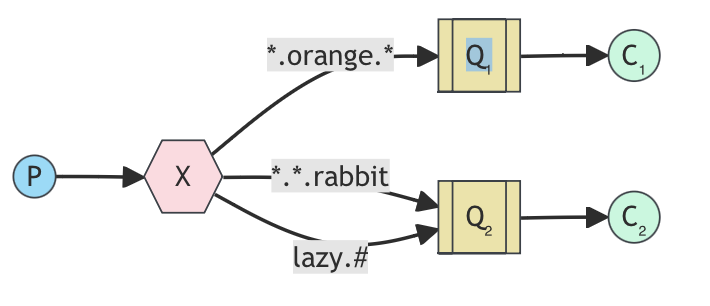

<!-- TOC -->

- [Simple Messaging System with RabbitMQ](#simple-messaging-system-with-rabbitmq)
	- [Description](#description)
	- [Technologies Used in this Project](#technologies-used-in-this-project)

<!-- /TOC -->
<!-- /TOC -->
<!-- /TOC -->

# Simple Messaging System with RabbitMQ

## Author info

- Author: Youjin Park
- GitHub account: thepeanutbasket (https://github.com/thepeanutbasket)
- UMD email: ypark112@umd.edu
- Personal email: park.youjin331@gmail.com

## Description

This is a Python-based project that leverages RabbitMQ, a robust messaging system, diving deeper into RabbitMQ's capabilities by incorporating message acknowledgement mechanisms to ensure reliable message delivery and fault tolerance. This project takes a step forward from a simple logging system to a more advanced system that uses a topic exchange instead of a direct exchange. With a topic exchange, messages can be routed based on multiple criteria. Specifically, this project will focus on how to subscribe to logs based on the severity of the log as well as the source that generated the log.

## Technologies Used in this Project
- **RabbitMQ**: An open-source message broker, which helps applications communicate asynchronously.
- **Docker**: A powerful platform designed to make it easier to create, deploy, and run applications by using containers. Docker run is entirely command line based
- **Docker Compose**: A tool for defining and running multi-container applications. Docker-compose reads configuration data from a YAML file.

## RabbitMQ: Messaging and Streaming Broker
- RabbitMQ is an open-source message broker, which helps applications communicate asynchronously. 
- It acts like a post office: applications send messages (letters) to queues (mailboxes), and RabbitMQ (postal workers) route them based on rules (sorting) to the appropriate queues (recipients) for processing later.

- **Topic Exchange**
    - Messages sent to a `topic` exchange can't have an arbitrary `routing_key` - it must be a list of words, delimited by dots. The words can be anything, but usually they specify some features connected to the message.
    - A few valid routing key exmamples: `stock.usd.nyse`, `nyse.vmw`, `quick.orange.rabbit`.
    - There can be as many words in the routing key as a user likes, up to the limit of 255 bytes.
    

    
    

    - In this example, the messages are sent with a routing key that consists of three words (two dots).
    - The first word in the routing key will describe a celerity, second a colour and third a species: `<celerity>.<colour>.<species>`.
    - Three bindings are created: Q1 is bound with binding key `*.orange.*` and Q2 with `*.*.rabbit` and `lazy.#`.
        - Q1 is interested in all the orange animals.
        - Q2 wants to hear everything about rabbits, and everything about lazy animals.
    - A message with a routing key set to `quick.orange.rabbit` will be delivered to both queues.
    - Message `lazy.orange.elephant` also will go to both of them.
    - Message `quick.orange.fox` will only go to the first queue.
    - Message `lazy.brown.fox` only to the second.
    - `quick.brown.fox` doesn't match any binding, so it will be discarded.

## Docker: Portable Container Platform
- Docker is a powerful platform designed to make it easier to create, deploy, and run applications by using containers. 
- Key concepts:
    - Containers: Containers allow a user to package up an application with all of the parts it needs, such as libraries and other dependencies, and ship it all out as one package. They are isolated from each other and the host system.
    - Images: Docker images are lightweight, standalone, executable packages that include everything needed to run a software application: code, runtime, system tools, system libraries, and settings. 
    - Dockerfile: A Docker file is a text document that contains all the commands a user could call on the command line to assemble an image. Using 'docker build', users can create an automated build that executes several command-line instructions in succession.
    - Docker Compose: Docker Compose is a tool for defining an running multi-container Docker applications. With Compose, a use uses a YAML file to configure application's services, networks, and volumes, and then create and start all the services from your configuration with a single command.
- With Docker Containers, users can create predictable environments that are isolated from other applications. Docker ensures that software behaves the same way regardless of where it is deployed.
- Once an application and its dependencies are containerized, the container can be shared among users, and it can run on any system that has Docker installed-regardless of the underlying infrastructure.
- Docker is ideal for building microservice architectures because each part of the application can be independently housed in separate containers. This makes managing each service or part of the app easier and more precise.

## Project Structure
- `Dockerfile`: creates an image based on Python 3.8, sets up the working directory, installs dependencies listed in requirements.txt, copies the application files, and sets the container to run emit_log_topic.py and receive_logs_topic.py when started.
- `docker-compose.yml`: defines the multi-container Docker applications for this project. It specifies services, networks, and volumes based on the Docker images and configurations.
- `emit_log_topic.py`: establishes a connection to a RabbitMQ server, declares a topic exchange named 'topic_logs', and sends a message with a routing key. The routing key and message are derived from command-line arguments, with defaults provided if no arguments are given.
- `receive_logs_topic.py`: connects to a RabbitMQ server, declares a topic exchange named 'topic_logs', and sets up an exclusive queue for receiving messages. It binds the queue to one or more routing keys specified via command-line arguments, listens for incoming messages, and prints them out as they arrive. If no routing keys are provided, the script displays usage information and exits.
- `requirements.txt`: lists a library that is needed for this project.

