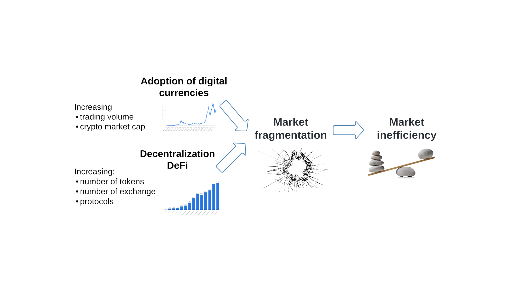
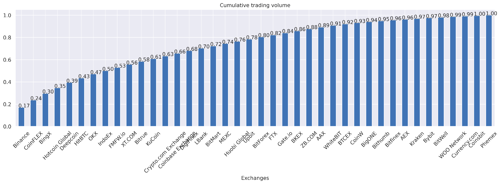
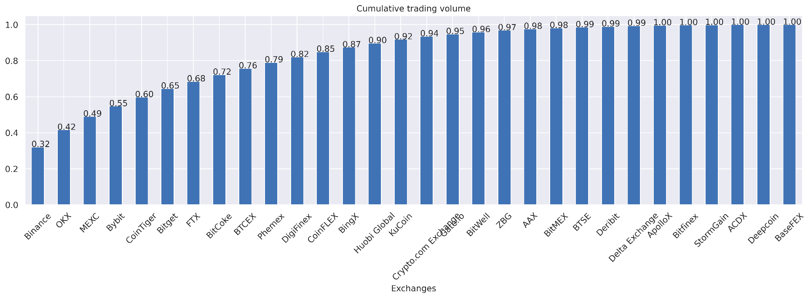
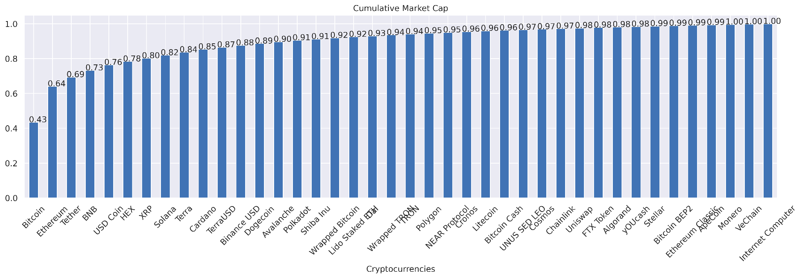
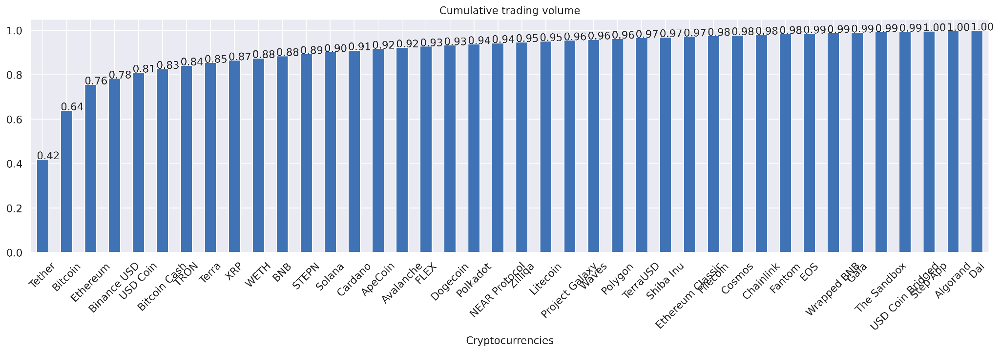
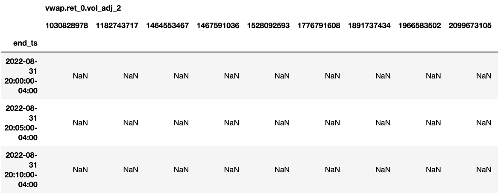

# Sorrentum: a protocol for virtual consolidation of distributed digital financial systems

GP Saggese, Paul Smith

v0.1 (Dec 1 2022)

# Abstract

Sorrentum[^1] is a protocol to:

- implement distributed investment strategies

- enforce a unified view of market exchanges, both centralized and
  decentralized, with benefits to the efficiency of the entire system

- incentivize participants that stake their cryptocurrencies to provide
  liquidity to digital asset markets

Sorrentum protocol contains:

- A framework for describing, simulating, assessing, and deploying financial
  machine learning models operating on any object on a blockchain (e.g.,
  cryptocurrencies, tokens, NFTs, smart contracts)

- A suite of standards for interoperability between components of the ecosystem
  (e.g., Sorrentum Oracles, Sorrentum Nodes, Market exchanges)

- Smart contracts allowing peer-to-peer staking of cryptocurrencies used to
  provide liquidity to the financial system and be rewarded with investment
  returns

# Motivation

Increasing adoption and continued decentralization of digital asset markets
fragments and distorts prices, leading to volatile markets.

{width="6.5in" height="2.5416666666666665in"}

At the current market capitalization of over $2+ trillion and daily trading
volume exceeding $50 billion across 20,000 currencies and 500 crypto exchanges,
research estimates pricing inefficiencies in digital markets to be between
$50m-200m per day.

The intrinsic appeals of crypto currency (i.e., the lack of a centralized
authority) and its rapid adoption across retail transactions will only
exacerbate the problem.

Historical solutions (e.g., Nasdaq regulation in the 1990s and US Government
Reg-NMS in 2005) have relied on government initiatives to regulate stock
exchanges and brokers to execute trades at the best possible price across
multiple exchanges. In the case of cryptocurrencies, such a solution is
impossible, given the decentralized nature of its market and the ways in which
consensus is achieved.

# Background

## Measures of fragmentation

TODO(gp): Redo the plots better

{width="6.5in"
height="2.3854166666666665in"}{width="6.499991251093613in"
height="2.3854166666666665in"}

{width="6.218640638670166in"
height="2.1625656167979in"}{width="6.1338145231846015in"
height="2.1625656167979in"}

## Arbitrage in financial crypto markets

Centralized market makers and hedge funds provide liquidity to markets in
exchange for substantial profits. Sorrentum Protocol democratizes the access to
these profits by allowing anybody to stake arbitrage activities, receiving
profits in return.

Building a quantitative investment firm has high barriers to entry, because it:

- needs trading capital (it can be proprietary or open to outsiders)

- collects fees when investing capital on behalf of outside investors

- needs to spend to hire expensive researchers and machine learning experts

- needs to spend money to buy external data

Problems with quantitative investment firms in traditional financial markets

- Opacity of returns

- Limitations for people to participate (e.g., accredited investors)

- Lock-in of capital

## Arbitrage

Different types of arbitrage with different risk and return profiles

- Mechanical arbitrage (single asset on different exchanges)

- Cross-asset arbitrage (single or

- Statistical arbitrage (enforce properties of

- Market making

TODO(gp): all Describe a bit

# Sorrentum Protocol

Sorrentum Node

- Receive data from exchanges and external oracles

- Export data using the Sorrentum Data Protocol

- People stake their currencies which are then used to run the nodes

- Nodes are scored in terms of their return quality, correlation with markets,
  drawdowns

- TODO(gp): This is System

Sorrentum Data Protocol

- Specifies how data can be fed to Sorrentum Nodes

- Point-in-time view (e.g., data is annotated with knowledge time)

- Clear semantic (e.g., using intervals and specify clearly interval semantic)

- Data quality assurance (e.g., historical and real-time reconciliation)

- TODO(gp): This is MarketData

Sorrentum Pools

- Liquidity pools used by Sorrentum nodes, where anybody can stake cryptos that
  Sorrentum Nodes can use and earn rewards

Sorrentum Library

- A library to build Sorrentum Nodes using fixed API

- Provides:

  - Sorrentum Data Protocol

  - Sorrentum Node Interface

  - Configuration layer

  - Financial ML: the universal pricing machine

  - Connectivity to Exchanges

- TODO(gp): This is amp

Sorrentum Token

- Governance token

- Used to compensate staked cryptos

- Used for returns for building and operating Sorrentum Nodes

## Universal pricing machine

It promotes efficiency of decentralized digital asset markets by using financial
machine learning to automatically price any digital currency or token.

It distills knowledge from a large variety of data sources (e.g., news, social
sentiment, financial databases, market data) to automatically estimate any
quantity of interest and its uncertainty, including:

- price, trading volume

- risk, volatility

- probability of specific events

for digital assets such as: crypto currency, non-fungible tokens (NFT), smart
contract

at different time scales ranging from seconds to days.

## Evaluating models

The same goal can be achieved with different research pipelines (with different
complexity to set-up and / or execution time):

- Run a model -> results_df -> post-processing + comparison

- Run models sweeping the params -> multiple results_df -> comparison

-

We want to separate how we compute the metrics and how we apply it

I think we did some work with Max about this, but not sure where it is.

We want to compute metrics (hit rate, pnl, SR, drawdown, $ per bet, MAE, AUC) as
function of:

- assets

- day of the week

- time of the day (e.g., between 9am and 10am, 10am and 11am)

- liquidity (e.g., how much volume was transacted)

- spread (...)

- ...

There is a common idiom (which we will formalize in the Sorrentum standard). In
practice the pipeline is:

**Step 1 (compute results_df)**

- Run the model and generate the usual output, then you can save / retrieve this
  output or just compute with the model on the flight
- The input is a multi-index dataframe in the DataFlow standard (results_df),
  like:

{width="6.5in" height="2.5416666666666665in"}

**Step 2 (annotate metrics_df)**

- IMO the best representation is multi-index (timestamp, asset_id) on the rows
  and columns equal to the features

  - We can call this format "metrics_df"

  - Each row is a prediction of the model

    - Feature1 (price), Feature2 (volume), ...

  - (timestamp, asset_id)

- There is a function that annotates each row (timestamp, asset_id) based on
  certain criteria (e.g., asset_id, day of the week, a value function of a vwap
  volume)

  - We have a library of function that accept a metrics_df and then decorates it
    with an extra tag

  - E.g., to split the results by asset_id the function creating the tag is
    something like (timestamp, asset_id) -> tag = asset_id

  - If you want to partition by time of the day you do (timestamp, asset_id) ->
    tag = timestamp.time()

  - ...

**Step 3 (split and compute metrics)**

- There is a function that computes a dict from tag to df (e.g., from asset_id
  to the corresponding df)

- Then we call the function to compute the metric (e.g., hit rate, pnl, ...) on
  each df and build a new dict tag -> transform(df)

  - The transform df accepts various column names to know what is the y, y_hat,
    ... (this dict is built from the model itself, saying what's the prediction
    col, the volatility, etc)

**Step 4 (aggregate results)**

- Finally we aggregate the results as function of the tag (e.g., asset_id ->
  pnl) and plot

- The output is a pd.DataFrame (with tag on the rows and metrics on the columns)

> Metric1
>
> Tag_value1
>
> ...

- E.g., asset_id -> pnl

> asset_id pnl conf_int

- 1030... ...

# Building financial primitives with Sorrentum Protocol

Building a Dark-Pool

Building algorithmic orders

Internal matching of orders

Smart order routing

Building a synthetic bond

- You like staking because it gives you something to do with your crypto

- You like yield because banks give you 0% APR and you don't have access

to investment opportunities

- Hence all the madness for yield farming

- People creates Ponzi scheme just because there was a huge demand for yield

but no supply (see the empty box from SBF)

- Meanwhile, our hedge fund needs cash to invest and gives you back the cash
  flow

from trading

- But this cash flow is bumpy. One month is good, one month is bad

- You don't like that

- The typical solution is "pay once a year" so that in average the total return

is positive, with high watermarks to account from crappy years

- Can we transform our hedge fund bumpy cash flow in something stable, but worse

in terms of expected return?

- Yes!

- You stake your crypto, we give you 0.5% / month (6% a year) in a mix of
  cryptos

- We try to give you always ETH and BTC, but sometimes we give you our

Sorrentum token

- You can sell or buy Sorrentum on the open market as any crypto

- Where does the value of Sorrentum come from (i.e., why does it trade at

more than 0, why is the box not empty)?

- Well, it's an IOU that we use to make the bumpy cash flow straight

- As long as the algo makes money in the long run, the Sorrentum token has

value

- Of course we pocket the difference between the 6% / yr that we pay users and

the 20% / yr we made

- Everybody wins

- Financial alchemy achieved!

- This would have been funded instantly few months ago

# Related projects

- Numerai

- Lean

- Quantopian

- Crypto-bots (e.g., Pionex)

- Amber / FalconX

- HummingbirdBot

- https://vega.xyz/

# Refs

[[Sorrentum Protocol - Technical appendix]{.underline}](https://docs.google.com/document/d/1Jp_yPU1FXFF7TdQjLiWzPzTLZmRLJ3KX0dooxArMQeI/edit)

[[Sorrentum protocol - Background research]{.underline}](https://docs.google.com/document/d/170IAWtrPUmMGXER-yIEFQ5zaArh2ksRNfvzciF6FLe0/edit#)

[[Sorrentum dir]{.underline}](https://drive.google.com/drive/u/1/folders/1icv3ifB095AIOMWtgr91v7mfR7Y7KaEl)

[^1]:
    Sorrentum is the Latin name of the coastal city of Sorrento in the South of
    Italy. In Greek mythology it was the place inhabited by Sirens, who tried to
    seduce Ulysses in one of the episodes of the Odyssey.
