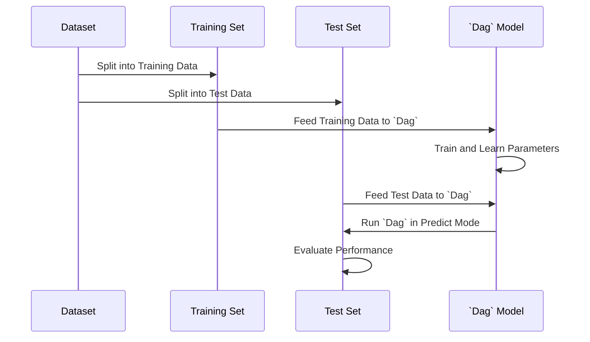
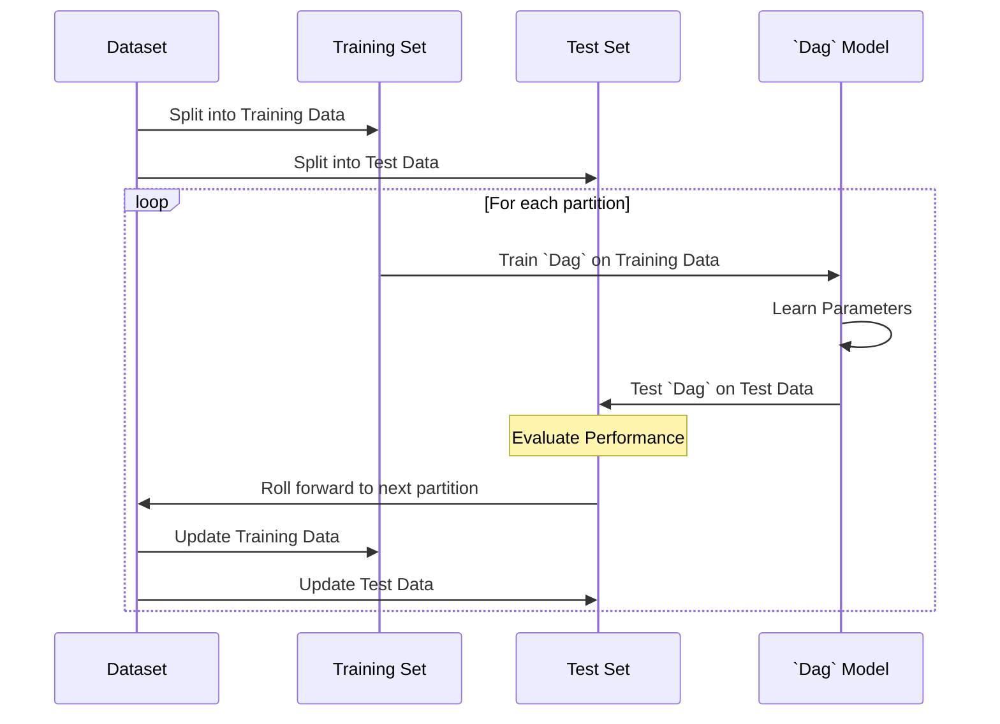

<!-- toc -->

- [Phases of evaluation of Dag](#phases-of-evaluation-of-dag)
  * [1. In-sample only experiment](#1-in-sample-only-experiment)
  * [2. Train/test experiment](#2-traintest-experiment)
  * [3. Train/validate/test experiment](#3-trainvalidatetest-experiment)
  * [4. Cross-Validation Experiment](#4-cross-validation-experiment)
  * [5. Rolling Train/Test Experiment](#5-rolling-traintest-experiment)

<!-- tocstop -->

# Phases of evaluation of Dag

A `Dag` computation can go through multiple phases (aka "methods").

In the following we use different terms with the same meaning:

- "fit", "learn", "train"
- "predict", "test"

Examples of phases are:

- Initialization phase
  - It entails any computation that needs to be done to reach a certain initial
    state
- Fit
  - Learn the state of the stateful nodes
- Validate
  - Learn hyperparameters of a system that has design parameters that need to be
    learned
  - E.g., number of epochs or layers in a neural network, time constant of a
    smoothing parameter
- Predict
  - Use the learned state of each node to predict values on unseen data
- Load state
  - Load previously learned state of stateful DAG nodes (e.g., weights of a
    model)
- Save state
  - Save learned state of DAG after a fit stage
  - E.g., learn model and serialize it for production
- Save results
  - Save artifacts from model execution (e.g., results of a predict phase)

The simulation kernel is in charge of scheduling these phases appropriately,
depending on the type of simulation to be performed, and on the dependency
across `Dag` nodes

E.g., the initialization phase can be used to load the state of a `Dag`
resulting from a previous fit phase, so that the `Dag` can run a subsequent
predict phase

This allows performing `Dag` operations in multiple ways

## 1. In-sample only experiment

- This involves testing the model on the same dataset that was used for training
- Of course, performance estimated only in-sample are optimistic
- The steps are:
  - Feed all the data to the `Dag` in fit mode (independently on batch,
    chunking, or streaming mode)
  - Learn parameters for `Dag`
  - Run `Dag` in predict mode on the same data used for fitting

- TODO(gp): AddPicture

## 2. Train/test experiment

- Aka in-sample/out-of-sample experiment

- The steps are:
  - Split the data in train and test sets without any overlap
  - Feed the train data to the `Dag` in fit mode
  - Learn parameters for `Dag`
  - Run the `Dag` in predict mode ont he test data

## 3. Train/validate/test experiment

- This is an extension of train/test experiment where the validation set is used
  to tune some hyper-parameters of the system

- TODO(gp): AddPicture

## 4. Cross-Validation Experiment

- This method involves using cross-validation for more robust model evaluation.

- The steps are:
  - Splitting the entire dataset into multiple smaller subsets.
  - For each subset:
    - Use the subset as the test set and the remaining data as the training set.
    - Feed the training data to the `Dag` in fit mode.
    - Learn parameters for the `Dag`.
    - Run the `Dag` in predict mode on the subset used as the test set.
  - Aggregate the performance across all subsets to assess the overall
    performance of the model.

- This approach provides a more comprehensive evaluation by using each part of
  the dataset for both training and testing, thereby reducing bias in the
  performance estimate.

- Note that this approach is valid using blocks of contiguous data for
  train/test but also with data points as long as there is no future peeking

- TODO(gp): AddPicture

## 5. Rolling Train/Test Experiment

- This approach is typically used in time-series analysis, where data is
  sequential.

- The steps are:
  - Sequentially partition the dataset into a series of train and test sets,
    ensuring that each test set immediately follows its corresponding training
    set in time.
  - For each partition:
    - Use the earlier data as the training set and the immediately following
      data as the test set.
    - Feed the training data to the `Dag` in fit mode.
    - Learn parameters for the `Dag`.
    - Run the `Dag` in predict mode on the test data.
  - This method simulates a real-world scenario where the model is trained on
    past data and tested on future, unseen data.

- The rolling aspect ensures that the model is continually updated and tested on
  the most recent data, reflecting more realistic and practical use cases for
  time-sensitive models.

