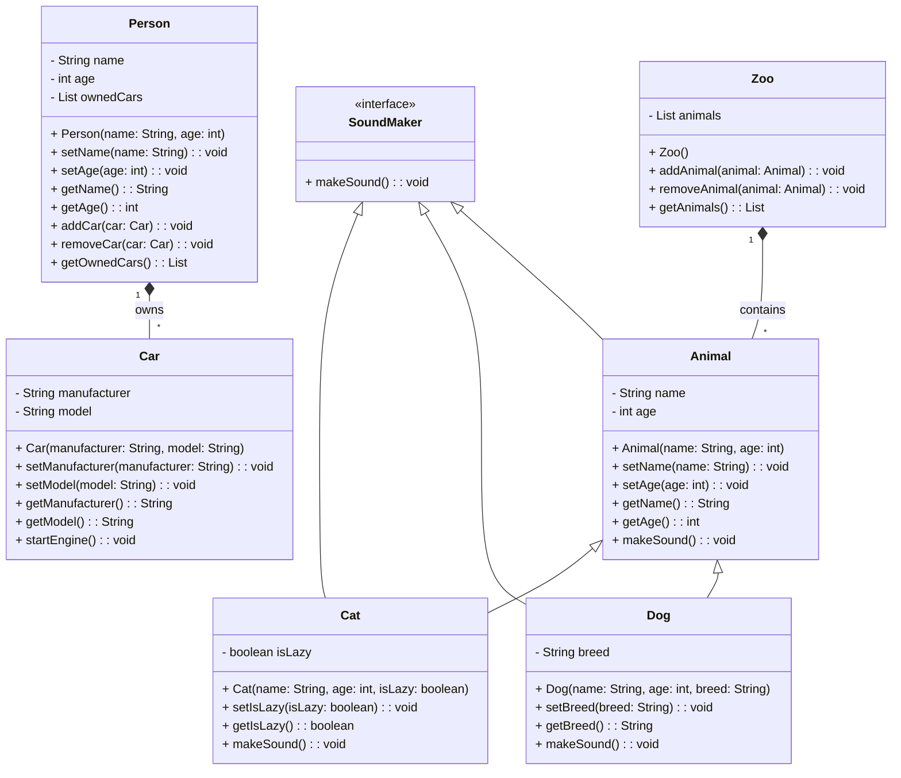

# Architecture Diagrams

<!-- toc -->

- [Summary](#summary)
- [Brief introduction to C4](#brief-introduction-to-c4)
  * [Different levels of detail](#different-levels-of-detail)
    + [(System) Context (Level 1)](#system-context-level-1)
    + [Container (Level 2)](#container-level-2)
    + [Component (level 3)](#component-level-3)
    + [Code (level 4)](#code-level-4)
- [Our conventions for C4 diagrams](#our-conventions-for-c4-diagrams)
  * [Mapping C4 and code structure](#mapping-c4-and-code-structure)
    + [(System) Context (Level 1)](#system-context-level-1-1)
    + [Container (Level 2)](#container-level-2-1)
    + [Component (Level 3)](#component-level-3)
    + [Component (Level 4)](#component-level-4)
  * [Use classes!](#use-classes)
  * [Generating class diagram](#generating-class-diagram)
- [Mermaid](#mermaid)
  * [Class diagram](#class-diagram)
  * [Support for C4](#support-for-c4)
  * [Render on-line](#render-on-line)
- [PlantUML](#plantuml)
  * [PlantUML is Markdown](#plantuml-is-markdown)
    + [`render_md.py` tool](#render_mdpy-tool)
      - [How to use](#how-to-use)
    + [Our conventions](#our-conventions)
  * [Plotting online](#plotting-online)
- [UML - Unified Modeling Language](#uml---unified-modeling-language)
  * [UML Class Diagrams](#uml-class-diagrams)
    + [Class Notation](#class-notation)
    + [Class Relationships](#class-relationships)
      - [Inheritance/Generalization](#inheritancegeneralization)
      - [Association](#association)
    + [Complete Example](#complete-example)

<!-- tocstop -->

# Summary

- We use C4 as a way to describe graphically software architecture together with
  some conventions
- Both Mermaid and PlantUML support C4 diagrams
- Mermaid is preferred since it can be rendered natively by GitHub
- PlantUML can be rendered through some of our scripts in regular markdown

# Brief introduction to C4

- A detailed description of C4 is https://C4model.com

- C4 stands for "context, container, component, code" (the 4 Cs)

- C4 model helps developers describe software architecture
  - It maps code at various level of detail
  - It is useful for both software architects and developers

## Different levels of detail

- The 4 levels of detail are:
  1. (System) Context system
     - How the system fits in the world
  2. Container
     - High-level technical blocks
  3. Component
     - Show the components inside a container (i.e., a high-level block)
  4. Code
     - Show how components are implemented
     - Represented in terms of UML class diagrams

### (System) Context (Level 1)

- A system context describes something that delivers value to its users
  - Typically a system is owned by a single software development team

- System context diagram shows the big picture of how the software system
  interacts with users and other systems in the IT environment

- The focus is not on:
  - Technologies
  - Protocols
  - Low-level details

- Audience:
  - Both technical and non-technical people
  - Both inside and outside the software development team

- A system system is made up of one or more containers

### Container (Level 2)

- A container represents an application
  - E.g.,
    - Server-side web application (e.g., Tomcat running Java EE web application,
      Ruby on Rails application)
    - Client-side web application (e.g., JavaScript running in a web browser,
      e.g., using Angular)
    - Client-side desktop application (e.g., an macOS application)
    - Mobile app (e.g., an iOS or Android app)
    - Server-side console application
    - Server-less function (e.g., AWS Lambda)
    - Database (e.g., MySQL, MongoDB)
    - Content-store (e.g., AWS S3)
    - File-system (e.g., a local filesystem)
    - Shell script

- A container runs some code and stores some data
  - Typically each container runs in its own process space
  - Containers communicate through inter-process communication

- A container diagram shows the high-level shape of the software architecture
  and how responsibilities are distributed across it

- A container is the sum of components
  - All components inside a container execute together
  - Components can't be deployed as separate units

- Audience:
  - Technical people
  - Inside and outside of the software development team

### Component (level 3)

- Component is a group of related functionality encapsulated behind a
  well-defined interface
  - E.g., collection of classes behind an interface

- A component diagram decomposes each container to identify major structural
  building blocks and interactions

- Audience
  - Software architects and developers

### Code (level 4)

- Code is the implementation of the software system
  - Each component can represented in terms of UML class diagrams, entity
    relationship diagrams, etc.
  - This diagram should be generated automatically from code

- Audience
  - Software architects and developers

# Our conventions for C4 diagrams

## Mapping C4 and code structure

- To simplify, we map the 4 levels of C4 in the code structure

### (System) Context (Level 1)

- = big picture of how the system interacts with users and other systems
- Mapped onto a code repository
- E.g.,
  - `//...` is a system providing data and analytics for commodity
  - `//pre-commit` is a system implementing a code linter

### Container (Level 2)

- = high-level software architecture and how responsibilities are split in the
  system
- Mapped onto the first level of directories in a repo
- E.g., in `//...`
  - `automl`: application for automatic machine learning for commodity analysis
  - `edgar`: application to handle EDGAR data
  - `etl3`: back-end db for time series with real-time and point-in-time
    semantics

### Component (Level 3)

- = a group of related functionality encapsulated behind a well-defined
  interface (e.g., collection of classes behind an interface)
- Mapped onto the second level of directory
- E.g., in `//.../edgar`
  - `api`: real-time system storing the data from EDGAR
  - `company_commodity_mapping`: data pipeline to process mapping between
    commodities and companies
  - `form8`: data pipeline processing form 8

### Component (Level 4)

- = OOP classes
- Typically we organize multiple related classes in files
- E.g., in `//.../edgar/form8`
  - `analyze_results.py`: classes and functions to analyze results from the data
    pipeline
  - `extract_tables.py`: class `TableExtractor` extracting tables from Form 8
  - `filter_tables.py`: class `TableFilterer`
  - `match_targets.py`
  - `normalize_table.py`

## Use classes!

- In order to be able to describe the system with C4 it is best to use classes
  to separate responsibilities and package code

- Using classes has the following advantages:
  - Organizes the code in cohesive parts
  - Makes clear what is a public interface vs a private interface (e.g.,
    helpers)
  - Highlights responsibility (e.g., builder, annotation, processor, analyzer)
  - Simplifies the interface of functions by sharing state in the object

- Note that classes still allow our favorite functional style of programming
  - E.g., pandas is implemented with classes and it allows functional style
  - The difference is going from:
    ```python
    f(ton of arguments)
    ```
    to
    ```python
    o(some argument).f(other arguments)
    ```

## Generating class diagram

- To generate a class diagram (level 4 of C4), you can run
  ```bash
  > dev_scripts/create_class_diagram.sh
  ```

# Mermaid

## Class diagram

- See https://mermaid.js.org/syntax/classDiagram.html

## Support for C4

- Mermaid supports most features of C4
  - See https://mermaid.js.org/syntax/c4.html

## Render on-line

- See https://mermaid.live/edit

# PlantUML

- Unified Modeling Language (UML) is a modeling language for software
  engineering to provide a standard way to visualize design of a system

- We use mainly Class Diagrams
  - For information on some class diagram convention see
    https://en.wikipedia.org/wiki/Class_diagram

- You can refer to the PDF guide at http://plantuml.com/guide for an extensive
  description of what PlantUML can do
  - We are mainly interested in the "Class diagram" section

- The website https://structurizr.com has lots of information on using tools for
  C4 and lots of [examples](https://structurizr.com/share/52804/plantuml)

## PlantUML is Markdown

- We use PlantUML for rendering diagrams in our documentation
  - For interactive use you can rely on online tools like:
    - Online editors:
      - [planttext](https://www.planttext.com/)
      - [liveuml](https://liveuml.com/)
      - [PlantUML Web Server](http://www.plantuml.com/plantuml/uml/SyfFKj2rKt3CoKnELR1Io4ZDoSa70000)
    - PyCharm plugin (create and edit `.puml` file locally):
      - [PlantUML integration](https://plugins.jetbrains.com/plugin/7017-plantuml-integration)

- We create `README.md` and `architecture.md` markdown files to document
  software. `README.md` is for general content, `architecture.md` is for code
  architecture description. You can embed the diagrams in `architecture.md` file
  in a correspondent folder.

- To render PlantUML in our markdown files instead of `@startuml` you need to
  use the tag:
  ````txt
  ```plantuml
  ...
  ```
  ````

### `render_md.py` tool

- We have a `render_md.py` tool to embed images after `plantuml` section.
  Typical usage to insert images to the markdown file and to preview it:
  ```bash
  > render_md.py -i knowledge_graph/vendors/README.md
  ```

#### How to use

1. Make sure `plantuml` is installed on your machine. The easiest way is to use
   the Docker container. All the packages typically needed for development are
   installed in the container.

2. How to use:
   ```bash
   > render_md.py -h
   ```

- We try to let the rendering engine do its job of deciding where to put stuff
  even if sometimes it's not perfect. Otherwise, with any update of the text we
  need to iterate on making it look nice: we don't want to do that.

- `.md` files should be linted by our tools

3. If you want to use `open` action, make sure that your machine is able to open
   `.html` files in the browser.

### Our conventions

- Names
  - Each name in mappings should be exactly the same (maybe without some invalid
    chars, like `.`) to not create a cognitive burden to the reader. It's better
    to optimize for readability rather than by the number of chars. E.g.,

    ```plantuml
    [build_configs.py] as build_configs_py
    [TableExtractor] as TableExtractor
    ```
  - We keep components / classes in alphabetical order, so we can find them
    quickly in the code

- Notes
  - Put notes describing some components / classes inside the blocks they refer
    to. E.g.,

    ```plantuml
    node mapping as map {
    [CIK<->Ticker] as ctmap
    note top of ctmap: My useful note.
    [CIK<->GVKEY] as cgmap
    }
    ```
  - We use conventions for notes as for the code comments:
    - Start a note with a capital and end with `.`. In this way, it may be even
      easier to visually distinguish notes from arrow labels.
    - Put notes straight after their related component definition, so a note
      will look like a comment in the code

- Arcs
  - The direction of the arcs represents the direction of the action. E.g.,

    ```plantuml
    apple --> ground : falls to
    ```
  - We use the third person for describing actions

- We use comments as headers to organize the `architecture.md`. Note that the
  comments in `plantuml` are introduced with `'`. Some frequently used headers
  are:
  - `' Components`
  - `' Databases`
  - `' Containers`
  - `' Edge labels`
  - `' Notes`

- An example of acceptable C4 diagram plantuml snippet:

  ```plantuml
    ' Components
    component [Edgar API] as Edgar_API
    note top of Edgar_API : System storing the real-time\nand historical data from EDGAR.
    component [Headers dataset] as Headers_dataset

    ' Databases
    database "Compustat DB" as Compustat_DB
    note top of Compustat_DB : Third-party database\nwith financial data.

    ' Containers
    node Form8 as form8 {
     [analyze_results.py] as analyze_results_py
     note left of analyze_results_py: Computes matching statistics.
     [build_configs.py] as build_configs_py
     [edgar_utils.py] as edgar_utils_py
     [run_pipeline.py] as run_pipeline_py
     [TableExtractor]
     note right of TableExtractor: Extracts forms tables.
     [TableNormalizer]
     note right of TableNormalizer: Normalizes extracted tables.
     [TableFilterer]
     note right of TableFilterer: Takes only financial tables\nfrom normalized tables.
     [TargetMatcher]
     note right of TargetMatcher: Matches financial values in tables.
    }
    node mapping as mapping {
     [CIK<->Ticker] as CIK_Ticker
     [CIK<->GVKEY] as CIK_GVKEY
    }
    node universe as universe{
     [S&P400]
     [S&P500]
     [S&P600]
     [S&P1500]
    }
    note left of universe: Universe of companies\n as Tickers/GVKEYs.

    ' Edge labels
    Edgar_API --> edgar_utils_py: provides filings payloads to
    Compustat_DB --> run_pipeline_py: provides target\nvalues to match on to
    build_configs_py --> run_pipeline_py: provides pipeline\nparameters to
    edgar_utils_py --> TableExtractor: provides universe filings to
    analyze_results_py --> run_pipeline_py: provides functions\nto run the matching in to
    mapping --> edgar_utils_py: provides mapping to construct\n universe as CIKs to
    Headers_dataset --> analyze_results_py: provides filing\ndates to
    TableExtractor --> TableNormalizer: provides tables to be normalized to
    TableFilterer --> run_pipeline_py: provides forms\n values to be matched to
    TargetMatcher --> analyze_results_py: matches values in
    TableNormalizer --> TableFilterer: provides tables to be filtered to
    universe --> mapping: provides universe of companies to
  ```

  You can find the correspondent `architecture.md` file
  [here](https://github.com/.../.../blob/master/edgar/forms8/architecture.md).

## Plotting online

- [Plantuml on-line](https://plantuml-editor.kkeisuke.com/)

# UML - Unified Modeling Language

- The Unified Modeling Language (UML) serves as a versatile visual modeling
  language designed to offer a standard way to visualize the design of a system

- UML employs a standardized notation for various diagram types, broadly
  categorized into three primary groups:
  - **Structure diagrams**: These diagrams depict the static elements within the
    system, highlighting essential components necessary in the modeled system.
    As they focus on system structure, they are extensively utilized in
    documenting software architecture
  - **Behavior diagrams**: These diagrams portray the dynamic aspects of the
    system, emphasizing the actions and processes required within the modeled
    system. Given their role in illustrating system behavior, they are
    extensively used to describe the functionality of software systems
  - **Interaction diagrams**: A subset of behavior diagrams, these emphasize the
    flow of data and control among the components within the modeled system

  

## UML Class Diagrams

- The UML Class Diagram is a graphical notation used to construct and visualize
  object-oriented systems
- A class diagram in the Unified Modeling Language (UML) is a type of static
  structure diagram that describes the structure of a system by showing the
  system's:
  - Classes
  - Attributes
  - Methods
  - Relationships among objects

### Class Notation

- A class represents a concept which encapsulates state (attributes) and
  behavior (methods)
- The class name is the only mandatory information
- The class diagram consists of
  - Class Name:
    - The name of the class appears in the first partition
    - The first letter is capitalized
  - Class Attributes:
    - Attributes are shown in the second partition
    - The attribute type is shown after the colon
    - The first letter is lowercase
    - Attributes map onto member variables (data members) in code
  - Class Methods:
    - Methods are shown in the third partition. They are services the class
      provides
    - The return type of a method is shown after the colon at the end of the
      method signature
    - The return type of method parameters are shown after the colon following
      the parameter name
    - The first letter is lowercase
    - Methods map onto class methods in code
  - Class Visibility:
    - The `+, -, #` symbols before an attribute and operation name in a class
      denote the visibility of the attribute and operation
    - `+` denotes public attributes or methods
    - `-` denotes private attributes or methods
    - `#` denotes protected attributes or methods

- An example of a Class Diagram is below

  ```mermaid
  classDiagram

  class BankAccount{
    #owner: str
    +balance: int
    +deposit(amount: float) bool
    +withdrawal(amount: float) int
    -checkBalance(account_number: int) float
  }
  ```

### Class Relationships

- Classes can engage in multiple relationships with other classes
- Relationships in UML class diagrams can be defined in several distinct types

#### Inheritance/Generalization

- It indicates that:
  - One of the two related classes (the subclass) is considered to be a
    specialized form of the other (the superclass) and
  - The superclass is considered a generalization of the subclass
- Each instance of the subclass is also an indirect instance of the superclass
- Represents an "is-a" relationship
- An abstract class name is shown in italics

- Example: in the given diagram, class `Animal` is the superclass and class
  `Duck` and `Fish` are its subclass

  ```mermaid
  classDiagram

  Animal <|-- Duck
  Animal <|-- Fish
  Animal : +int age
  Animal: +isMammal()
  class Duck{
    +String beakColor
    +swim()
  }
  class Fish{
    -int sizeInFeet
    -canEat()
  }
  ```

#### Association

- Associations are relationships between classes in a UML Class Diagram
- They are represented by a solid line between classes
- Simple Association
  - A structural link between two peer classes
  - There is an association between Class1 and Class2

  ```mermaid
  classDiagram

  Class1 --> Class2
  ```

- Aggregation
  - A special type of association which represents a "part of" relationship
  - Variant of the "has-a" association relationship
  - Many instances (denoted by the diamond) of `Duck` can be associated with
    `Pond`
  - `Duck` is part of `Pond`
  - Objects of `Pond` and `Duck` have separate lifetimes
  - In the given e.g., a Pond has zero or more Ducks, and a Duck has at most one
    Pond (at a time). Duck can exist separately from a Pond

  ```mermaid
  classDiagram

  Pond o-- Duck
  ```

- Composition
  - A special type of aggregation where parts are destroyed when the whole is
    destroyed
  - Objects of `Class2` live and die with `Class1`
  - `Class2` cannot stand by itself
  - In the given e.g., a `Car` has exactly one `Carburetor`, and a `Carburetor`
  - Is a part of one `Car`. `Carburetor`s cannot exist as separate parts,
    detached from a specific `Car`

  ```mermaid
  classDiagram

  Car *-- Carburetor
  ```

- Dependency
  - An object of one class might use an object of another class in the code of a
    method. If the object is not stored in any field, then this is modeled as a
    dependency relationship
  - Exists between two classes if changes to the definition of one may cause
    changes to the other (but not the other way around)
  - `Class1` depends on `Class2`

  ```mermaid
  classDiagram

  Class1 ..> Class2
  ```

- Realization
  - It is a relationship between the blueprint class and the object containing
    its respective implementation level details
  - This object is said to realize the blueprint class
  - For e.g., the `Owner` interface might specify methods for acquiring property
    and disposing of property. The `Person` and `Corporation` classes need to
    implement these methods, possibly in very different ways

  ```mermaid
  classDiagram

  class Owner{
    <<interface>>
    +accquire(property: str) bool
    +dispose(property: str) bool
  }

  class Person{
    -real
    -tangible
    +accquire(property: str) bool
    +dispose(property: str) bool
  }

  class Corporation{
    -current
    -fixed
    -longterm
    +accquire(property: str) bool
    +dispose(property: str) bool
  }

  Person ..|> Owner
  Corporation ..|> Owner
  ```

### Complete Example


