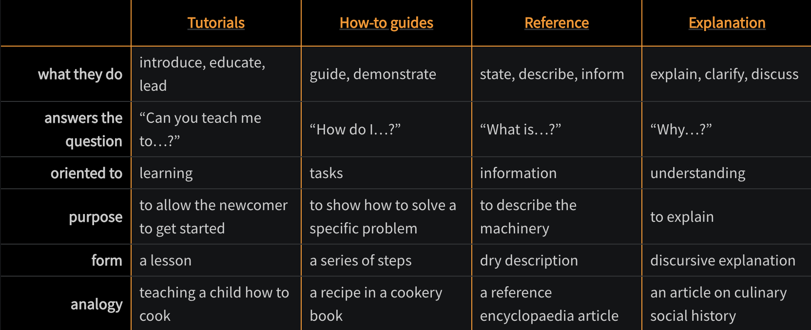

<!-- toc -->

- [Diataxis: a framework to write documentation](#diataxis-a-framework-to-write-documentation)
- [Tutorial](#tutorial)
- [How-to guide](#how-to-guide)
- [Reference](#reference)
- [Explanation](#explanation)

<!-- tocstop -->

# Diataxis: a framework to write documentation

For more information look [https://diataxis.fr/](https://diataxis.fr/)

There are 4 modes of documentation

- Tutorial
- How-to guide
- Reference
- Explanation

# Tutorial

- Learning oriented
- Is a playground for users to learn something about the product by completing a
  set of steps and achieving a meaningful result
- Helps the user/client achieve more understanding of the product
- Assumes the user does not have prior knowledge of the features used in the
  tutorial
- Food analogy: teaching a child how to cook starting from cutting carrots,
  celery, and onions for lasagna "battuto"
- File suffix: `.tutorial.md`
- Example:
  [datapull/ck.create_airflow_dag.tutorial.md](https://github.com/cryptokaizen/cmamp/blob/master/docs/datapull/ck.create_airflow_dag.tutorial.md)

# How-to guide

- Goal oriented
- Is a guide to complete a real-world task
- Assumes the user has some knowledge about the background of used technology
- Food analogy: a recipe for cooking lasagna
- File suffix: `.how_to_guide.md`
- Example:
  [work_tools/all.pycharm.how_to_guide.md](https://github.com/cryptokaizen/cmamp/blob/master/docs/work_tools/all.pycharm.how_to_guide.md)

# Reference

- Information oriented
- Provide a technical description of a component/piece of infra. The emphasis is
  on completeness and accuracy
- Is difficult to keep everything up to date, so mostly rely on code and
  docstring
- Food analogy: a reference encyclopaedia article about ingredients used in
  lasagna (e.g., tomatoes, basil)
- File suffix: `.reference.md`
- Example:
  [datapull/ck.ccxt_exchange_timestamp_interpretation.reference.md](https://github.com/cryptokaizen/cmamp/blob/master/docs/datapull/ck.ccxt_exchange_timestamp_interpretation.reference.md)

# Explanation

- Understanding oriented
- Is used in our documentation to explain design decisions and choices,
  architecture of components, how components interacted
  - E.g., high level broker explanation (what kind of behavior the broker class
    encapsulates)
- Does not provide specifications or instruction
- Food analogy: an article on culinary social history
- File suffix: `.explanation.md`
- Example:
  [documentation_meta/all.architecture_diagrams.explanation.md](https://github.com/cryptokaizen/cmamp/blob/master/docs/documentation_meta/all.architecture_diagrams.explanation.md)
