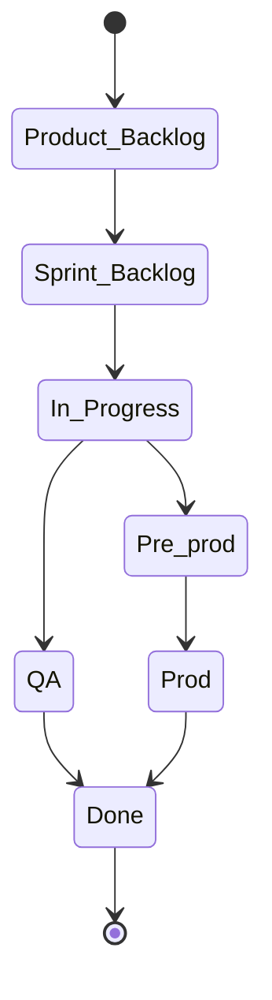

# GitHub/ZenHub workflows

<!-- toc -->

- [Introduction](#introduction)
- [Concepts](#concepts)
  * [Sprints](#sprints)
  * [Epics](#epics)
    + [Master Epics](#master-epics)
    + [Sub-Epics](#sub-epics)
    + [List of Epics](#list-of-epics)
  * [Issue](#issue)
  * [Milestone](#milestone)
  * [Label](#label)
    + [List of labels](#list-of-labels)
  * [Pipeline](#pipeline)
  * [Issue Estimate](#issue-estimate)
  * [PR](#pr)
- [Issue workflows](#issue-workflows)
  * [Filing a new issue](#filing-a-new-issue)
  * [Updating an issue](#updating-an-issue)
  * [Closing an issue](#closing-an-issue)
- [PR workflows](#pr-workflows)
  * [PR labels](#pr-labels)
  * [Filing a new PR](#filing-a-new-pr)
    + [General tips](#general-tips)
    + [Filing process](#filing-process)
  * [Review](#review)
  * [Addressing comment](#addressing-comment)
  * [Coverage reports in PRs - discussion](#coverage-reports-in-prs---discussion)

<!-- tocstop -->

# Introduction

- In the following we use the abbreviations below:
  - GH = GitHub
  - ZH = ZenHub
  - PR = Pull Request
  - RP = Responsible party (aka Team Leader)
- Everything we work on comes in the form of a GH Issues
  - We call GH Issues "issues", and "tasks", (sometimes "tickets")
    interchangeably
  - We avoid to call them bugs since many times we use GH to track ideas,
    activities, and improvements, and not only defects in the code
  - We file tasks, prioritize them, and distribute the workload across the team
  - We try to always work on high priority (aka, P0) tasks
- We use
  [ZenHub](https://app.zenhub.com/workspaces/cm-615371012ed326001e044788/board?repos=586614470)
  as project management layer on top of GH
  - Please install the [ZH extension](https://www.zenhub.com/extension) for GH,
    since it is going to make your life easier

# Concepts

## Sprints

- Sprints are weekly, Monday - Friday and consist of the Issues worked on during
  the week
- Sprints help us answer the questions
  - What work should the team be focusing during this week?
  - What did the team achieve last week?
- Anything worked on during a week is added to that week's Sprint
- Issues added to a Sprint but not worked on or completed during the week should
  not be removed (Issues can belong to more than one Sprint, and not removing
  helps measure how “overloaded” a Sprint was)
- Each week's Sprint has Issues added to it by Team Leaders before Monday's work
  begins
- Every Issue in a Sprint should have
  - a point estimate
  - an Epic
- The Team Member working on the Issue sets the point estimate by themselves or
  together with the Team Leader
- Each sprint should have limits based on the estimates. E.g., a sprint cannot
  have issues worth more than 30 (arbitrary hyper-parameter) story points
- To support adaptability and flexibility, Issues may be added to a Sprint
  mid-week (but Issues should not be removed). While this may require
  sacrificing other Issues in the Sprint, the point is to make the trade-off
  apparent

## Epics

- Epics are thematic groups of Issues that are somehow related by their topic
  - It may take multiple Sprints to complete all the Issues in an Epic
  - Most Epics are created around software components or user workflows (which
    may cross software components)
- Epics help us answer the questions
  - What features is the team implementing?
  - What is the team's current focus?
- Epics with a high level of activity are versioned and have a well-defined
  purpose
  - We distinguish Master Epics (e.g., `WEB3`) and sub-Epics (e.g.,
    `WEB3 - DaoCross v0.1`)
- We maintain all the information about what the Epic is about in its
  description
- We keep the Epics alphabetized on the board under the pipeline "EPICs"

### Master Epics

- Master Epics are long-running Epics (i.e., projects)
  - E.g., `WEB3`
  - They are capitalized (e.g., `WEB3` and not `web3` or `Web3`)
- Each Issue should belong to at least one Epic, either a sub-Epic or a master
  Epic
  - There is no need to add an Issue to a Master Epic if it is already added to
    a sub-Epic, since this is handled automatically by ZH

### Sub-Epics

- Master Epics can be broken down into smaller Epics, called "sub-Epics"
  - E.g., `WEB3 - DaoCross v0.1`
- Their titles should follow the pattern: `XYZ - ABC vM.N`, where:
  - `XYZ`: master Epic title (capitalized)
  - `ABC`: sub-Epic title (camel case or snake case)
  - `vM.N`: version
- Sub-Epics should have a short title and a smaller scope
- Some sub-Epics are related to short term milestones or releases (e.g.,
  `WEB3 - DaoCross v0.1`), other sub-Epics are for long-running activities
  (e.g., `WEB3 - DaoCross`)
- Sub-Epics should belong to a Master Epic in ZH so that querying by Epic and
  sub-epics is simplified

### List of Epics

- Below there is a list of the Epics and sub-Epics

  - For simplicity we keep the information about the Epics here, instead of
    ZenHub

- Epics can be determined based on:
  - Software components
    - E.g., `CORE` covers code under `//amp/core`
    - We should try to have a direct mapping between software components and
      directories
  - Theme
    - E.g., `TRADE_EXECUTION` covers code related to multiple software
      components
  - Sometimes an Issue could go in different Epics
- Typically from the Epic should be easy to find the assignee in terms of team
  leader that can then re-route the Issue to somebody on their team
- Epics can be qualified as `Dev` or `Research` depending if they are related
  more to implementation or to research / experimentation

> TODO(all): Review and update

- `BUILD`
  - Description: anything related to the build / regression system
  - `Breaks`
    - Description: Report breaks in the GH action system or locally
    - We follow the Buildmeister procedures
  - `GH Actions`
    - Description: Improvements to the build system
- `CODEBASE`
  - Description: anything that relates to the entire code base
  - E.g., a global replace of `act` and `exp`
- `CONFIG`
  - Description: Anything related to `config` implementation
- `CORE`
  - Description: Anything in `//amp/core` (but not dataflow)
- `DATAFLOW`
  - Description: Anything related to `//amp/core/dataflow`
- `DATAPULL`
  - Description: Everything related to Instrument Master, data extraction, data
    on-boarding
- `DEV_TOOLS`
  - Description: Anything related to (non-research) tools we use
  - `Docker`
    - Anything related to improvements and fixes to the docker workflow
    - Example: [#19](https://github.com/cryptomtc/cmamp/issues/19),
      [#28](https://github.com/cryptomtc/cmamp/issues/28),
      [#30](https://github.com/cryptomtc/cmamp/issues/30)
  - `Thin_env`
    - Description: Anything related to improving the thin env in
      `dev_scripts/client_setup/`
- `DOCS`
  - Description: Anything related to documentation
  - `Publish documentation`
    - Description: Anything related to publishing Google Docs, Markdown to repo
- `HELPERS`
  - Description: Anything in `//amp/helper`
- `HIRING`
  - Anything related to:
    - Screening candidates
    - Running interviews
    - Creating job descriptions
    - Finding channels to propagate job descriptions
- `INFRA/DevOps`
  - Description: Anything related to IT/Cloud infrastructure, code deployment,
    CI/CD, monitoring, server administration etc.
- `INVOKE`
  - Description: Anthing related to invoke tasks, their unit testing comes here
- `LINTER`
  - Description: Issues related to the `linter`
- `MARKETING`
  - Description: Issues related to promoting our product, e.g.,
    - Prepare a demo of the production system
    - Prepare pnl / trades data and send it to investors
    - Prepare a power-point presentation for investors
- `MARKET_DATA`
  - Description: anything related to MarketData
- `MODEL`
  - `Alpha research`
    - Specific research tasks that we want to perform (e.g., "test the foobar
      hypothesis")
    - Multiple implementation issues can be filed to support performing a
      certain research task (e.g., "implement this and that")
  - `Backtesting`
    - Run experiments about existing alpha models (e.g., tuning parameters,
      portfolio construction)
    - Flows for backtesting alpha ››
    -
    - Flow for backtesting portfolio construction
    - Backtests and analysis for candidate models
  - `Deployment`
    - It includes reconciliation, monitoring
    - Flows for deploying models from research to production
    - Support for testing model config changes in production
    - Model reconciliation
    - Pipeline failure debugging
  - `Exploratory research`
    - E.g., build a notebook about some stylized facts about prices, model
- `ON-BOARDING`
  - Description: Issues related to on-boarding new team members and improvements
    to the on-boarding process
- `OPTIMIZER`
  - `Dev`
    - Features and config for optimizer
    - Optimizer testing
  - `Research`
- `PROCESS`
  - Description: Anything meta (e.g., conventions)
  - `EpicMeister`
    - Description: Anything related to improving the epicmeister process
- `PROD`
  - Description: Anything related to releasing to production
- `TRADE_EXECUTION`
  - `Dev`
    - Description: it's about anything related to software engineering (e.g.,
      implementation of new features, adding testing, fixing bugs, refactoring)
    - E.g., create a new broker
  - `Research`
    - Description: i.e., data science on execution experiment
    - E.g., notebooks about bid / ask
- `UNIVERSE`
  - Description: Related to on-boarding / exploring a new universe
- `WEB3`
  - Description: Anything related to Web3 tasks
  - `Arbitrage`
  - `Tulip`
  - `Utils`

## Issue

- Each Issue is a piece of work to be done
- Issues are combined into Epics by topic
- An Issue has certain characteristics, i.e. labels
- An Issue has a progress status, i.e. ZH pipeline (e.g.,
  `Product backlog (P1)`, `In progress`, `Done/Pre-prod`)
- PRs are linked to work needed to complete an Issue
- An issue might not have an assignee and estimate if it is not inside an epic
  but before execution of course it needs to be resolved

## Milestone

- Milestone consist of group of tasks we want to accomplish during certain
  period
- We plan for milestone in advance and every milestone is 4 to 5 months long
- We select Epics to work on in the particular milestone, add issues to it and
  assign a start date and an estimated end date to the epic
- Every Epic, pre-planned or newly filed, must have an estimated start and end
  date if it belongs to current milestone
  - Epics can also have dates from future as well to get clear estimation of the
    milestone
  - Not having a start and end date to an Epic is fine if it does not belong to
    the current milestone

## Label

- Labels are attributes of an issue (or PR), e.g., `good first issue`,
  `PR_for_reviewers`, `duplicate`, etc.
- See the current list of labels and their descriptions are
  [KaizenFlow](https://github.com/kaizen-ai/kaizenflow/labels) and
  [cmamp](https://github.com/cryptokaizen/cmamp/labels)
  - The repos should always have labels in sync

### List of labels

- `Blocking`: This issue needs to be worked on immediately
- `Bug`: Something isn't working
- `Cleanup`:
- `Design`
- `Documentation`: Improvements or additions to documentation
- `Enhancement`: New feature or request
- `Epic`
- `good first issue`: Good for newcomers
  > TODO(gp): `Good_first_issue`
- `Outsource`: Anybody can do it
- `P0`: Issue with a high priority
- `P1`: Issue is important but has less priority
- `P2`: Issue whcih is not urgent and has the lowest priorty
- `Paused`: An issue was started and then stopped
- `PR_for_authors`: The PR needs authors to make changes
- `PR_for_reviewers`: The PR needs to be reviewed by team leaders
  > TODO(gp): -> `PR_for_team_leaders`
- `PR_for_integrators`: The PR needs to be reviewed by Integrators and possibly
  merged
- `Readings`: Reading a book, article and getting familiar with code
- `To close`: An issue can be potentially closed
  > TODO(gp): -> To_close

## Pipeline

- A ZH Pipeline represents the "progress" status of an Issue in our process
- We have the following Pipelines on the ZH board:
  - `Product Backlog`
    - Issues which are new and do not belong to current sprint
    - `estimate` is not mandatory
    - It should at least have Master `EPIC` (e.g., `INFRA`), not necessarily but
      preferred sub-EPIC (e.g., `INFRA - DevOps`)
    - `assignee` should be the tech lead of that area
  - `Sprint Backlog`
    - Issues that should be executed in the this sprint
    - It must have an `assignee`, `epic`, `sprint` and `estimate`
  - `In Progress`
    - Issues that we are currently working on
  - `Review/QA`
    > TODO(gp): Let's split Review and QA?
    - Issues opened for review and testing
    - Code is ready to be merged pending feedback
    - Code is ready to be deployed to pre-production
  - `Done/Pre-prod`
    > TODO(gp): Let's split Done and Pre-prod?
- `Done/Pre-prod` - Issues that are done and are waiting for closing
  - `Epics`
    - Both Master Epics and Sub-Epics
  - `Closed`
    - Issues that are done and don't need a follow-up
    - Integrators / team leaders are responsible for closing



## Issue Estimate

- The Issue estimates ranges from 1 to 5:
  - 1 (e.g., a function rename, updating the entire code base and the unit
    tests)
  - 2 (e.g., factoring out a method)
  - 3 (e.g., write a unit test for an existing function)
  - 4 (e.g., implement a new feature, where the solution is clear in advance)
  - 5 (e.g., implement a new feature, where the solution is complex)

## PR

- A pull request is an event where a contributor asks to review code they want
  to merge into a project

# Issue workflows

## Filing a new issue

- Use an informative description (typically an action "Do this and that")
  - We don't use a period at the end of the title
- If it is a "serious" problem (bug) put as much information about the Issue as
  possible, e.g.,:
  - What you are trying to achieve
  - Command line you ran, e.g.,
    ```
    > i lint -f defi/tulip/test/test_dao_cross_sol.py
    ```
  - **Copy-paste** the error and the stack trace from the command line, no
    screenshots, e.g.,
    ```
    Traceback (most recent call last):
      File "/venv/bin/invoke", line 8, in <module>
        sys.exit(program.run())
      File "/venv/lib/python3.8/site-packages/invoke/program.py", line 373, in run
        self.parse_collection()
    ValueError: One and only one set-up config should be true:
    ```
  - The log of the run
    - Maybe the same run using `-v DEBUG` to get more info on the problem
  - What the problem is
  - Why the outcome is different from what you expected
- Issue in the current sprint cannot be `P1` because `P0` is a sprint backlog
  and an issue is not in a sprint backlog, it should not be in a sprint.
- Use check boxes for "small" actions that need to be tracked in the Issue (not
  worth their own Issue)
  - An issue should be closed only after all the checkboxes have been addressed
    OR the remaining checkboxes were either transformed into new issues in their
    own right (e.g. if the implementation turned out to be more complex than
    initially thought) OR have a reason for not being implemented
  - These things should be mentioned explictly before closing the issue (Element
    of Least Surprise.).
- We use the `FYI @...` syntax to add "watchers"
  - E.g., `FYI @cryptomtc` so that he receives notifications for this issue
  - Authors and assignees receive all the emails in any case
  - In general everybody should be subscribed to receiving all the notifications
    and you can quickly go through them to know what's happening around you
- Assign an Issue to the right person for re-routing
  - There should be a single assignee to a Issue so we know who needs to do the
    work
  - Assign Integrators / Team leaders if not sure
- Assign an Issue to one of the pipelines, ideally based on the urgency
- If you are not sure, leave it unassigned but `@tag` Integrators / team leaders
  to make sure we can take care of it
- Assign an Issue to the right Epic and Label
  - Use `Blocking` label when an issue needs to be handled immediately, i.e. it
    prevents you from making progress
  - If you are unsure then you can leave it empty, but `@tag` Integrator / team
    leaders to make sure we can re-route and improve the Epics/Labels

## Updating an issue

- For large or complex Issues, there should be a design phase (in the form of GH
  Issue, Google Doc, or design PR) before starting to write a code
  - A team leader / integrator should review the design
- When you start working on an Issue, move it to the `In Progress` pipeline on
  ZH
  - Try to use `In Progress` only for Issues you are actively working on
  - A rule of thumb is that you should not have more than 2-3 `In Progress`
    Issues
  - Give priority to Issues that are close to being completed, rather than
    starting a new Issue
- Update an Issue on GH often, like at least once a day of work
  - Show the progress to the team with quick updates
  - Update your Issue with pointers to gdocs, PRs, notebooks
  - If you have questions, post them on the bug and tag people
- Once the task, in your opinion, is done, move an issue to `Review/QA` pipeline
  so that Integrator / team leaders can review it
- If we decide to stop the work, add a `Paused` label and move it back to the
  backlog, e.g., `Sprint backlog (P0)`, `Product backlog (P1)`, `Icebox (P2)`

## Closing an issue

- A task is closed when PR has been reviewed and merged into `master`
- When, in your opinion, there is no more work to be done on your side on an
  Issue, please move it to the `Done/Pre-prod` or `Review/QA` pipeline, but do
  not close it
  - Integrators / team leaders will close it after review
- If you made specific assumptions, or if there are loose ends, etc., add a
  `TODO(user) `or file a follow-up Issue
- Done means that something is "DONE", not "99% done"
  - "DONE" means that the code is tested, readable, and usable by other
    teammates
- Together we can decide that 99% done is good enough, but it should be a
  conscious decision and not comes as a surprise
- There should be a reason when closing an issue
  - E.g. - closing as PR is merged
  - E.g. - closing since obsolete

# PR workflows

## PR labels

- `PR_for_authors`
  - There are changes to be addressed by an author of a PR
- `PR_for_reviewers`
  - PR is ready for review by team leaders
- `PR_for_integrators`
  - PR is ready for the final round of review by Integrators, i.e. close to
    merge

## Filing a new PR

### General tips

- Implement a feature in a branch (not `master`), once it is ready for review
  push it and file a PR via GH interface
- We have `invoke` tasks to automate some of these tasks:
  ```
  > i git_branch_create -i 828
  > i git_branch_create -b Cmamp723_hello_world
  > i gh_create_pr
  ```
- If you want to make sure you are going in a right direction or just to confirm
  the interfaces you can also file a PR to discuss
- Mark PR as draft if it is not ready, use the `convert to draft` button

  - Draft PR should be filed when there is something to discuss with and
    demonstrate to the reviewer, but the feature is not completely implemented

    

### Filing process

- Add a description to help reviewers to understand what it is about and what
  you want the focus to be
  - Add a pointer in the description to the issue that PR is related to - this
    will ease the GH navigation for you and reviewers
- Leave the assignee field empty
  - This will be done by team leaders
- Add reviewers to the reviewers list
  - For optional review just do `@FYI` `person_name` in the description
- Add a corresponding label
  - Usually the first label in the filed PR is `PR_for_reviewers`
  - If it is urgent/blocking, use the `Blocking` label
- Make sure that the corresponding tests pass
- Always lint before asking for a review
- Link a PR to an issue via ZH plugin feature
  
- If the output is a notebook:
  - Publish a notebook, see
    [here](https://github.com/cryptokaizen/cmamp/blob/master/docs/work_tools/all.development.how_to_guide.md#publish-notebooks)
  - Attach a command line to open a published notebook, see
    [here](https://github.com/cryptokaizen/cmamp/blob/master/docs/work_tools/all.development.how_to_guide.md#open-a-published-notebook)

## Review

- A reviewer should check the code:
  - Architecture
  - Conformity with specs
  - Code style conventions
  - Interfaces
  - Mistakes
  - Readability
- There are 2 possible outcomes of a review:
  - There are changes to be addressed by author
    - A reviewer leaves comments to the code
    - Marks PR as `PR_for_authors`
  - A PR is ready to be merged:
    - Pass it to integrators and mark it as `PR_for_integrators`
      - Usually is placed by team leaders after they approve PR

## Addressing comment

- If the reviewer's comment is clear to the author and agreed upon:
  - The author addresses the comment with a code change and after changing the
    code (everywhere the comment it applies) marks it as `RESOLVED` on the GH
    interface
  - Here we trust the authors to do a good job and to not skip / lose comments
  - If the comment needs further discussion, the author adds a note explaining
    why he/she disagrees and the discussion continues until consensus is reached
- Once all comments are addressed:
  - Re-request the review
  - Mark it as `PR_for_reviewers`

## Coverage reports in PRs - discussion

- We should start posting coverage reports in PRs.

- The suggested process is:
  - PR's author posts coverage stats before (from master) and after the changes
    in the format below. The report should contain only the files that were
    touched in a PR.
    - We have `run_coverage_report` invoke
      - `TODO(*): Enable for KaizenFlow and add usage examples.`
    - Maybe we can automate it somehow, e.g., with GH actions. But we need to
      start from something.
      ```
      Name                                    Stmts   Miss Branch BrPart  Cover
      -------------------------------------------------------------------------
      oms/locates.py                              7      7      2      0     0%
      oms/oms_utils.py                           34     34      6      0     0%
      oms/tasks.py                                3      3      0      0     0%
      oms/oms_lib_tasks.py                       64     39      2      0    38%
      oms/order.py                              101     30     22      0    64%
      oms/test/oms_db_helper.py                  29     11      2      0    65%
      oms/api.py                                154     47     36      2    70%
      oms/broker.py                             200     31     50      9    81%
      oms/pnl_simulator.py                      326     42     68      8    83%
      oms/place_orders.py                       121      8     18      6    90%
      oms/portfolio.py                          309     21     22      0    92%
      oms/oms_db.py                              47      0     10      3    95%
      oms/broker_example.py                      23      0      4      1    96%
      oms/mr_market.py                           55      1     10      1    97%
      oms/__init__.py                             0      0      0      0   100%
      oms/call_optimizer.py                      31      0      0      0   100%
      oms/devops/__init__.py                      0      0      0      0   100%
      oms/devops/docker_scripts/__init__.py       0      0      0      0   100%
      oms/order_example.py                       26      0      0      0   100%
      oms/portfolio_example.py                   32      0      0      0   100%
      -------------------------------------------------------------------------
      TOTAL                                    1562    274    252     30    80%
      ```
- PR's author also sends a link to S3 with the full html report so that a
  reviewer can check that the new lines added are covered by the tests
