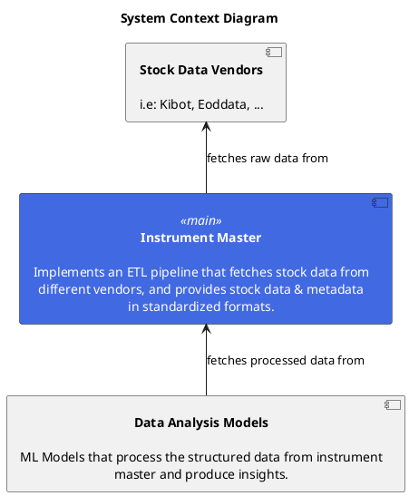
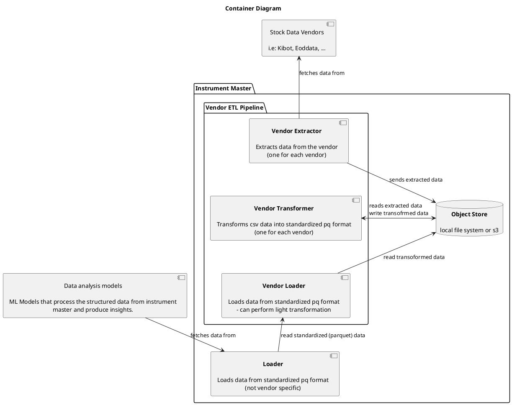
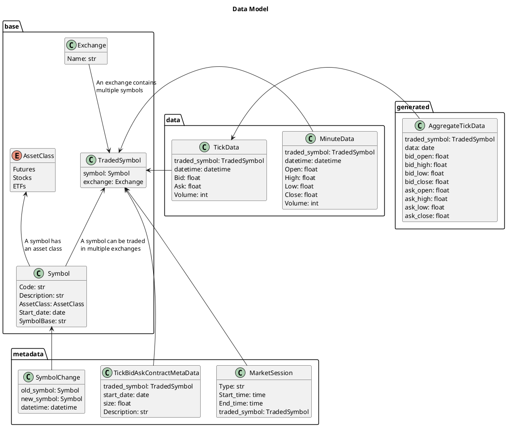
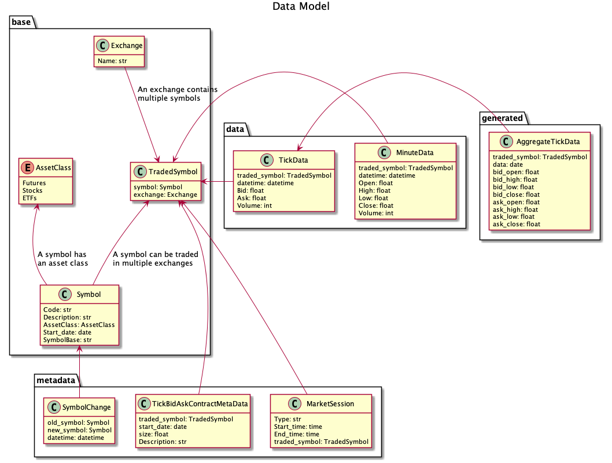

<!--ts-->
   * [Overview](#overview)
   * [Architecture](#architecture)
      * [System context diagram](#system-context-diagram)
      * [Container Diagram](#container-diagram)
         * [Questions](#questions)
         * [Notes](#notes)
   * [Data Model](#data-model)
      * [Notes](#notes-1)
   * [Proposed Code Layout](#proposed-code-layout)
      * [Guidelines](#guidelines)
      * [Questions](#questions-1)


<!--te-->

# Overview

At a high level, we want to implement a system that:

- Downloads the price data (both historical & also real-time) from different
  data sources (we already have Kibot interface and want to add an interface for
  EODData)
- Downloads and saves the related metadata
- Convert CSV price data into a suitable format for fast querying (e.g., Parquet
  format)
- Implement mapping between metadata and price data
- Allow to query the system to get specific price time series based on symbol
  name
  - It should handle:
    - Different frequency (e.g., end-of-day vs 5 minutes vs 1 minute)
    - Different asset classes (e.g., equities vs futures vs forex vs ...)
    - Different providers (e.g., `kibot` vs `eoddata` vs `firstrate` vs ...)
  - This system has:
    - Different backends for different data providers (e.g., Kibot, EODData)
    - A layer to make all the data uniform from the semantics point of view

# Architecture

Note: The documentation of the architecture follows the C4 model:
https://c4model.com/.

## System context diagram




## Container Diagram




### Questions

1. How does each stage in the container diagram run? are they all manually
   triggered? this view implies that these stages run independently, which I
   believe is desired, but we could also use a sequence diagram to highlight how
   these should be triggered.

TODO(Amr): Add a sequence diagram later

> GP: We will run the extractor and transformer only once to generate historical
> data.
>
> Later we will implement a real-time processor (e.g., with Airflow) that keeps
> the data updated. The interface of course won't change

### Notes

- I didn't reflect caching in this diagram just yet
- `data` refers to both stock data & metadata in this context
- The vendor loader can do light transformation because we may need to test out
  some transformation steps, and the transformer step is sometimes too costly to
  allow that.

TODO(Amr): think if there's a better way to handle this, perhaps caching could
help mitigate these costier steps, and transformation doesn't need to be a
single step.

# Data Model




## Notes

- Generated data should be behind an interface (then it computed on the fly or
  cached somehow).

# Proposed Code Layout

Based on the container diagram, the code layout matches the different containers
that we have.

```ansi
types/  # standardized types (see data model above)
loader/  # adapts all vendor loaders to a common interface
vendors/
   kibot/
      extractor/
      transformer/
      loader/
      types/  # vendor specific types
      config.py  # s3 paths, credentials for vendor
   eoddata/
      extractor/
      transformer/
      loader/
      types/
      config.py
```

## Guidelines

- `extractor` should only download the data, and keep it as close to the
  downloaded structure as possible (ideally not modify it at all.)
- Downloading already downloaded data should be a no-op by default (before
  downloading, check that the file doesn't exist in s3). This behavior should be
  overridable by a command line arg: `--override` (which is the opposite of
  `--incremental`)
- `extractor` & `transformer` share certain types, and s3 paths (where
  `extractor` outputs files and `transformer` picks them up), those would be
  saved in `config.py`
- We should make a distinction between `data` & `metadata` in all of the
  packages.

TODO(Amr): be more specific about how to make that distinction

## Questions

1. For the `extractor` package, should these be individual runnable scripts? or
   should we have a `download all` script/command?

> **GP:** I would do individual scripts, since this for now is a one-off
> operation and we will download data in chunks
>
> I'm also ok with a single script with --dataset to control which subset of the
> data to download / transform

2. Should we have a coverage matrix for which data each vendor fulfills?

> **GP:**: Not urgent
